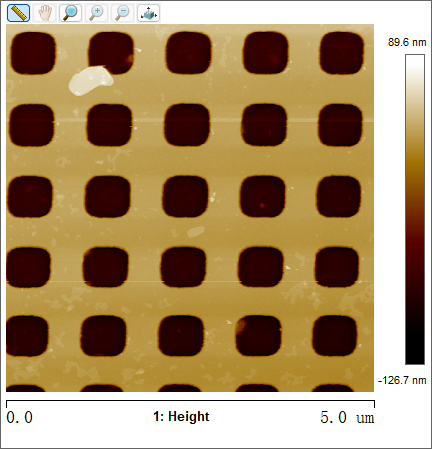
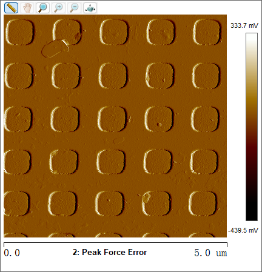

# 地球化学分析技术实验报告
> Coursework artifact · Nanjing University · 2026  
> Original course module: Analytical Geochemistry laboratory · AFM calibration-grid characterization

## 实验五：原子力显微镜（AFM）— 校准栅格表征

**实验人：** 杜鑫宇  
**实验日期：** 2026年5月27日  
**课程：** 地球化学分析技术

---

## 1. 实验目的

- 了解原子力显微镜（Atomic Force Microscopy, AFM）的基本工作原理及其在表面形貌表征中的应用
- 掌握 Bruker MultiMode 8 AFM 在 PeakForce Tapping 模式下的操作方法
- 利用标准校准栅格对 AFM 的扫描精度和成像质量进行评价

---

## 2. 仪器原理简述

### 2.1 原子力显微镜（AFM）工作原理

原子力显微镜通过检测尖锐探针针尖与样品表面之间的原子间相互作用力来获得样品表面的三维形貌信息。其核心部件包括微悬臂（末端带有纳米级尖锐针尖）、激光检测系统（激光束聚焦在悬臂背面，反射至位置敏感光电探测器）和压电扫描器（精确控制探针与样品间的相对位置）。当探针针尖接近样品表面时，针尖原子与样品表面原子间产生 van der Waals 力，导致悬臂发生微小弯曲，PSPD 检测激光光斑位置的变化并将其转换为电信号，从而实时反馈样品表面的高度信息。

### 2.2 PeakForce Tapping 模式

本实验采用 PeakForce Tapping 模式，该模式由 Bruker 公司开发。在每个像素点处，探针以远低于共振频率（通常 1–2 kHz）的频率进行周期性的逼近-回退运动，实时记录力-距离曲线，直接提取峰值力作为反馈信号。与传统轻敲模式相比，该模式对针尖和样品的损伤更小，可直接获取定量力学信息（模量、粘附力等），在液体环境中成像也更稳定。

### 2.3 力-距离曲线

在 PeakForce Tapping 的每个逼近-回退周期中，探针与样品间的作用力随针尖-样品距离的变化构成力-距离曲线，可提取接触点、峰值力、粘附力和模量等信息。本实验中模量拟合采用 Hertzian (Spherical) 球-平面接触模型。

---

## 3. 样品与实验条件

### 3.1 实验设备

| 项目 | 规格 |
|------|------|
| **AFM 主机** | Bruker MultiMode 8 |
| **扫描模式** | PeakForce Tapping |
| **探针型号** | SNL-10（Bruker） |
| **探针悬臂** | A 臂 |
| **探针共振频率** | 65 kHz |
| **弹性常数** | 0.35 N/m |
| **针尖材质** | 氮化硅（Si₃N₄）悬臂，硅针尖 |

### 3.2 实验样品

- **样品名称：** Bruker PG Platinum Coated Calibration Grid
- **结构描述：** 镀铂（Pt）硅基底标准校准栅格，圆角矩形柱状凸起
- **标称周期：** 1.0 µm × 1.0 µm（中心间距）

### 3.3 扫描参数

| 参数 | 数值 |
|------|------|
| **扫描范围** | 5.0 µm × 5.0 µm |
| **分辨率** | 512 × 512 像素 |
| **扫描速率** | 0.976 Hz |
| **数据通道** | Height + Peak Force Error |
| **采集通道** | 粘附力、模量（Hertzian 拟合） |
| **温度** | 室温 |

---

## 4. 结果和分析

### 4.1 形貌分析（Height 通道）

实验获得的 AFM 高度图像（图 1）显示，在 5 µm × 5 µm 的扫描区域内可清晰观察到 **5 × 5 = 25 个圆角矩形凸起结构**，呈等间距阵列排列。相邻凸起的中心间距约为 **1.0 µm**，观测到的周期性结构与标称 1 μm 栅格间距近似一致。根据色标，当前图像水平化/偏移处理后的显示相对高度范围为 **−126.7 nm − 89.6 nm**，跨越零点，显示动态范围约 216 nm。凸起呈现为圆角矩形轮廓，边缘清晰，无明显拖尾或畸变。

**图 1：AFM 高度图（2D 俯视图）**

*扫描范围 5 µm × 5 µm，512 × 512 像素，显示色标范围（当前图像水平化/偏移后的相对值）：−126.7 nm（深色）− 89.6 nm（亮色）*

### 4.2 力学信息分析（Peak Force Error 通道）

Peak Force Error 通道（图 2）反映探针扫描过程中实际峰值力与设定点之间的偏差信号。图像整体呈现均匀的橙色调，对应显示信号范围 **−439.5 mV − 333.7 mV** 的中间区域。力误差信号的均匀性说明扫描过程中 Peak Force 反馈控制稳定，探针-样品间的相互作用力保持一致。在凸起边缘处可见力误差信号的小幅变化，反映探针跟踪形貌变化时反馈系统的响应。

**图 2：AFM Peak Force Error 图**

*显示信号范围：−439.5 mV − 333.7 mV*

### 4.3 周期与尺度验证

根据扫描范围和阵列特征进行定量验证：

$$
\text{理论周期} = \frac{\text{扫描范围}}{\text{阵列数}} = \frac{5.0\;\mu\text{m}}{5} = 1.0\;\mu\text{m}
$$

观测到的周期性结构与标称 1 μm 栅格间距近似一致；5 × 5 阵列覆盖了扫描区域的绝大部分。该算术关系不构成独立的严格标定，且未进行 line-profile 台阶高度测量，因此不声称完成严格的垂直标定。

### 4.4 图像质量评价

| 评价指标 | 表现 |
|----------|------|
| **周期性** | 5 × 5 阵列排列规整，周期均匀 |
| **边缘清晰度** | 圆角矩形轮廓清晰，无模糊或振铃伪影 |
| **噪声水平** | 基底区域平坦，无明显条纹噪声或尖峰噪声 |
| **显示色标范围** | Height 通道显示色标覆盖约 216 nm 动态范围（当前水平化/偏移后的相对值），分辨力充足 |

---

## 5. 讨论

### 5.1 扫描模式对校准栅格成像的影响

PeakForce Tapping 模式在 0.976 Hz 的扫描速率下，512 × 512 像素的分辨率为 5 µm × 5 µm 的扫描范围提供了充分的形貌细节。对于校准栅格这类具有陡峭边缘的样品，该模式相比传统 Tapping Mode 能更精确地追踪表面轮廓，图像中圆角矩形的清晰边缘直观反映了这一优势。

### 5.2 探针选择依据

SNL-10 探针的 A 臂弹性常数为 0.35 N/m，属于软悬臂范畴，适用于中等硬度样品的表面成像。对于镀铂硅基底，该刚度在 PeakForce 模式下既能获得足够的形貌对比度，又不会对针尖或基底造成损伤。

### 5.3 柱高不均匀性分析

当前图像水平化/偏移后的显示相对高度在 −126.7 nm − 89.6 nm 范围内变化，约 216 nm 的显示跨度可能来源于校准栅格制造过程中镀铂层厚度分布的微小差异，也可能是样品表面残留污染物或扫描平面的倾斜效应所致。该数值为当前图像的显示相对范围，不代表经 line-profile 测量验证的柱体真实台阶高度。

### 5.4 力反馈系统的稳定性

Peak Force Error 通道的均匀橙色调表明整个扫描过程中探针-样品间的作用力控制稳定，反馈系统处于良好的工作状态。力误差信号在凸起边缘的小幅变化是探针追踪形貌起伏时的正常响应。

---

## 6. 结论

- 通过 Bruker MultiMode 8 AFM 在 PeakForce Tapping 模式下观察了 PG 镀铂校准栅格在 5 µm × 5 µm 范围内的表面形貌，获得了 5 × 5 圆角矩形阵列的高分辨率图像
- 观测到的周期性结构与标称 1 μm 栅格间距近似一致
- 当前图像水平化/偏移后的显示相对高度范围为 −126.7 nm − 89.6 nm，显示动态范围约 216 nm
- Peak Force Error 图的均匀信号表明反馈系统在扫描过程中保持稳定
- SNL-10 探针（A 臂）配合 PeakForce Tapping 模式适用于亚微米尺度周期结构的形貌表征
