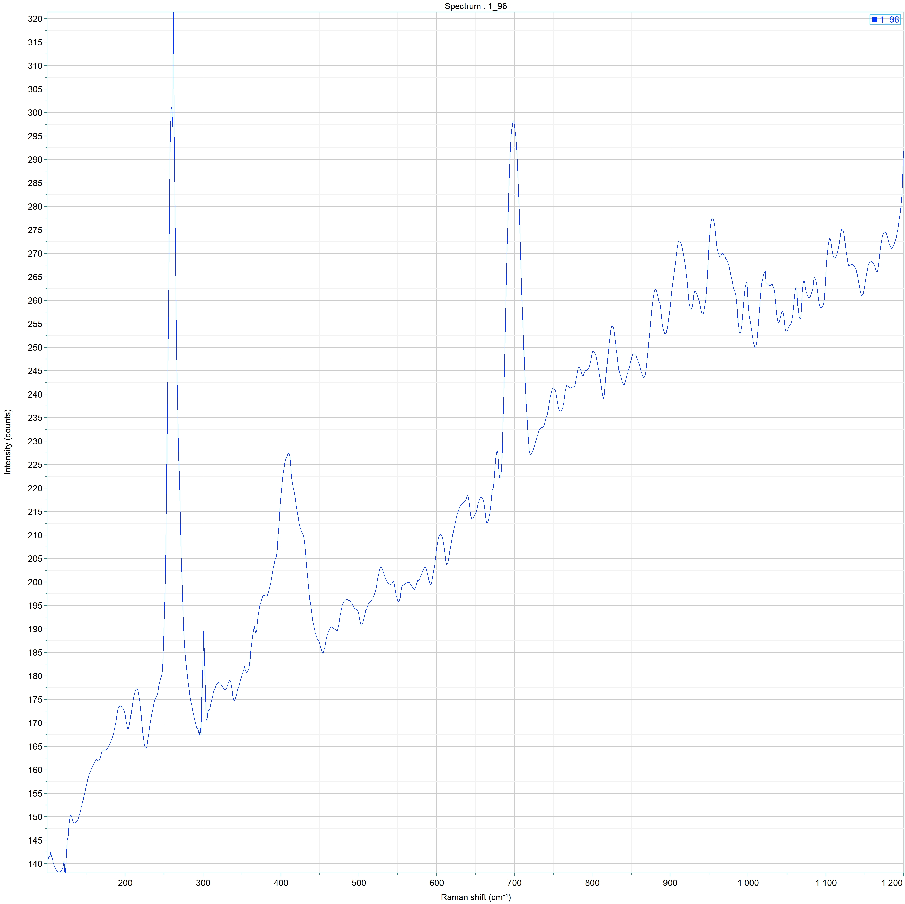
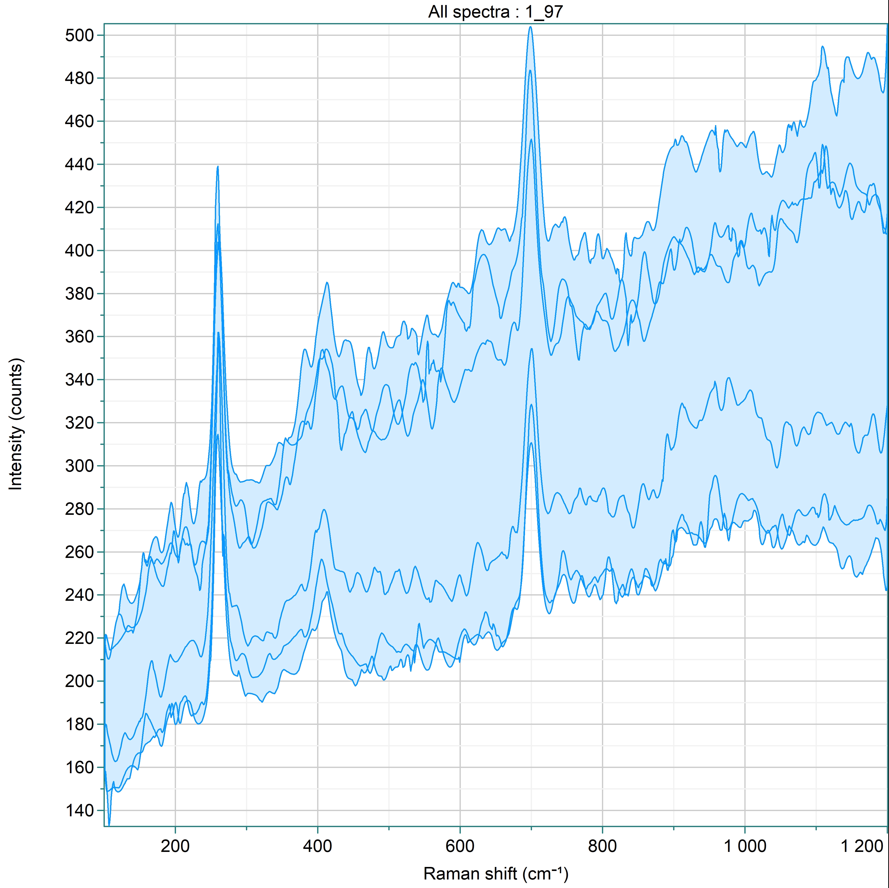
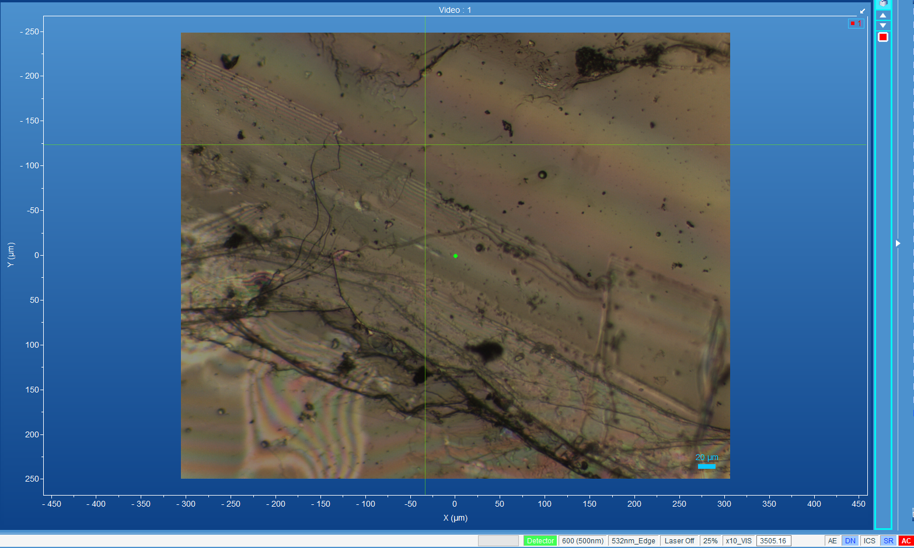
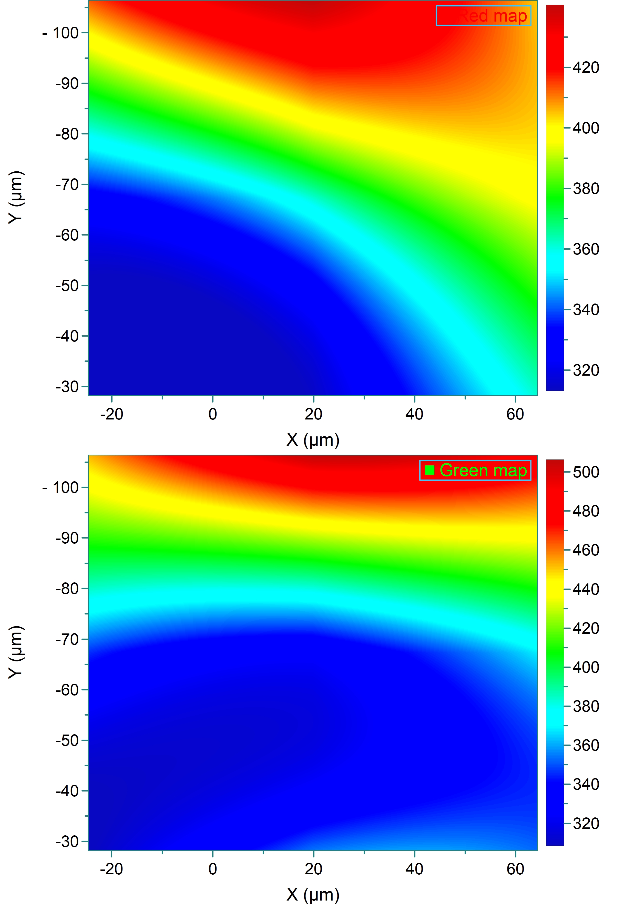

# 地球化学分析技术实验报告
> Coursework artifact · Nanjing University · 2026  
> Original course module: Analytical Geochemistry laboratory · Raman spectroscopy of muscovite

## 实验四：激光拉曼光谱 — 矿物鉴定与光谱分析

**实验人：** 杜鑫宇  
**实验日期：** 2026年5月20日  
**课程：** 地球化学分析技术

---

## 1. 实验目的

- 了解激光拉曼光谱的基本原理和仪器结构
- 掌握拉曼光谱分析在矿物鉴定中的应用方法
- 学习使用 HORIBA LabRAM 型拉曼光谱仪进行矿物样品测试
- 通过特征拉曼峰识别矿物种类，理解拉曼位移与矿物结构的对应关系

---

## 2. 仪器原理简述

### 2.1 拉曼效应基本原理

拉曼光谱基于光的非弹性散射效应。当单色激光照射样品时，大部分光子发生瑞利散射（弹性散射，频率不变），而约 10⁻⁷ 的入射光子与分子振动能级发生能量交换，产生非弹性散射：

- **斯托克斯散射：** 光子能量减小（频率降低），对应分子从基态跃迁到振动激发态
- **反斯托克斯散射：** 光子能量增加（频率升高），对应分子从振动激发态回到基态

拉曼位移（Raman shift，单位 cm⁻¹）定义为散射光与入射光的波数差，反映了矿物晶格的振动模式特征。每种矿物具有独特的拉曼特征峰组合，如同"分子指纹"，可用于快速、无损的矿物鉴定。

### 2.2 仪器结构

本次实验所用仪器为 **HORIBA LabRAM** 型共聚焦拉曼光谱仪，主要结构包括：

- **激发光源：** He-Ne 激光器，波长 632.8 nm
- **显微系统：** 共聚焦显微镜，可将激光聚焦至微米级区域
- **色散系统：** 光栅分光
- **检测器：** CCD 探测器

### 2.3 数据处理流程

采集到的原始谱图需经以下处理：

- **基线校正：** 扣除荧光本底和背景散射
- **寻峰：** 确定主要拉曼峰的准确位置
- **谱库比对：** 将谱图与标准矿物拉曼数据库进行相关性比对，获得 HQI 匹配质量分数

---

## 3. 样品简述

### 3.1 样品信息

| 项目 | 内容 |
|------|------|
| **样品名称** | 白云母（Muscovite） |
| **化学式** | KAl₃Si₃O₁₀(OH)₂ |
| **矿物分类** | 层状硅酸盐（phyllosilicate），云母族 |
| **样品来源** | 实验室提供的矿物标准柱 |

### 3.2 实验条件

| 参数 | 设定 |
|------|------|
| 仪器型号 | HORIBA LabRAM |
| 激光波长 | 632.8 nm（He-Ne） |
| 光谱范围 | 100–1200 cm⁻¹ |
| 数据点 | 1038 |

### 3.3 实验流程

1. 打开拉曼光谱仪电源，启动控制软件（LabSpec 6）
2. 将矿物样品置于载物台上，调整焦平面使激光聚焦于样品表面
3. 设定采集参数（光谱范围、积分时间、累加次数）
4. 采集谱图，观察原始信号质量
5. 进行基线校正，消除荧光背景
6. 使用仪器自带的谱库进行自动比对鉴定
7. 记录匹配结果，输出图谱和数据

---

## 4. 结果和分析

### 4.1 拉曼谱图总览

本样品在 100–1200 cm⁻¹ 的拉曼位移范围内进行了光谱采集。

**点扫谱图（Point：1_96）：** 如图 1 所示，为一单点光谱，谱线呈典型的白云母特征。图中可观察到两个最显著的拉曼峰，分别位于约 260 cm⁻¹ 和约 700 cm⁻¹。谱图整体呈自左向右逐渐上升的趋势（即高波数区强度高于低波数区），这是荧光背景叠加在拉曼信号上造成的基线漂移，经基线校正后即可消除。

**面扫谱图（MAP All spectra: 1_97）：** 如图 2 所示，为面扫描区域所有像素点的光谱叠加图，包含多条并行的曲线。各条曲线趋势一致，峰位相同（均在 ~260 cm⁻¹ 和 ~700 cm⁻¹ 有明显峰），但强度存在一定差异，反映样品表面不同区域的拉曼信号强弱不同。整体基线同样呈从左向右的上升趋势。

### 4.2 谱库比对结果

将实测谱图与 HORIBA 拉曼数据库进行相关性比对，匹配结果如下：

| 参数 | 数值 |
|------|------|
| 数据库匹配名称 | **Muscovite**（白云母） |
| HQI | **87.62** |
| 数据库编号 | RHX #158 |
| 数据库名称 | Raman - Forensic - HORIBA |
| 化学式 | KAl₃Si₃O₁₀(OH)₂ |
| 来源 | Ossala, Italy |
| CAS登记号 | 1318-94-1 |

HQI 值达 87.62，表明实测谱图与数据库标准谱高度匹配，鉴定结果为白云母无误。

### 4.3 拉曼峰位归属分析

白云母的拉曼振动可分为以下几类模式：

| 拉曼位移 (cm⁻¹) | 强度 | 振动归属 |
|-----------------|------|---------|
| **261.8** | 强（最强峰） | K⁺ 层间阳离子振动 / Si-O-Al 面外弯曲振动 |
| **698.7** | 强 | Si-O-Si 对称伸缩振动 |
| ~1022 | 中弱 | Si-O 非对称伸缩振动 |
| 912–955 | 弱–中 | Si-O-Al 耦合振动 / 晶格模式 |

经自动寻峰确认，两个最显著峰位的精确值为 **261.8 cm⁻¹** 和 **698.7 cm⁻¹**，与白云母标准谱图特征吻合。次要峰位包括 912 cm⁻¹、954 cm⁻¹、1022 cm⁻¹ 等。

#### 4.3.1 ~262 cm⁻¹ 低频强峰的归属

白云母在 261.8 cm⁻¹ 的强峰是本谱图中最强的信号，主要来源于两个振动贡献的叠加：

- **层间阳离子（K⁺）的平移振动：** 白云母的 TOT 层之间靠 K⁺ 连接，K⁺ 在 12 配位环境中的振动模式在低频区产生强拉曼信号
- **Si-O-Al 面外弯曲振动：** 四面体层中 Al 取代 Si 引起的结构畸变导致的弯曲振动

该峰强度很大，是白云母最显著的鉴别特征之一。

#### 4.3.2 ~699 cm⁻¹ 中频强峰的归属

698.7 cm⁻¹ 的强峰对应 Si-O-Si 桥氧的对称伸缩振动，是层状硅酸盐矿物中普遍存在的特征振动模式。峰形较尖锐，说明样品结晶度较好。

#### 4.3.3 1000–1100 cm⁻¹ 宽峰

该区域较宽的肩峰对应于非桥氧的 Si-O⁻ 伸缩振动（层面内的 Si-O 末端键），由于白云母中四面体层的 Si/Al 有序分布，该区域峰形较为复杂。

### 4.4 光学显微观察

**样品光学图像：** 图 3 为样品的光学显微照片。视野中可见样品主体呈浅黄色、半透明状，符合白云母的典型光学特征。样品表面分布有大小不一的黑色裂隙，可能来自白云母的极完全解理，或在制片过程中产生的机械裂隙。视域比例尺为 20 μm。

### 4.5 拉曼面扫成像

对面扫区域的拉曼数据进行处理，获得拉曼峰强度面分布图：

**Green Map 与 Red Map（图4）：** 图为拉曼峰强度面分布图，包含 Green Map 和 Red Map 两张成像（合并显示于同一张图中），分别基于不同拉曼特征峰的积分强度进行成像，反映特定振动模式在样品表面的空间分布差异。

两幅图的整体分布趋势大体相似，说明白云母的成分分布相对均匀。但也存在以下差异：

- Red Map 中信号强度呈左下蓝色 → 中间青色 → 对角线绿色 → 右上角黄色至红色的渐变分布
- Green Map 中蓝色区域更大，下约 2/3 区域均为蓝色，分层界限更加水平

这种差异可能来源于白云母表面不同区域的解理方向或晶体取向不同，使拉曼散射截面对特定振动模式产生差异，并非成分不均一所致。

---

## 5. 讨论

### 5.1 白云母的拉曼光谱特征与矿物结构的关系

白云母属于 2:1 型层状硅酸盐（TOT 结构），由两层硅氧四面体夹一层 Al 八面体构成，层间由 K⁺ 连接。其拉曼光谱可归因于以下几个结构单元：

1. **硅氧四面体层：** Si-O 键的伸缩和弯曲振动主导了中频区（400–800 cm⁻¹）的拉曼信号，~699 cm⁻¹ 的强峰即来源于此
2. **八面体层：** Al-O 以及 OH 相关的振动主要出现在低频区（< 400 cm⁻¹）和 900–1100 cm⁻¹
3. **层间阳离子：** K⁺ 在 12 配位环境中的平移振动在 ~262 cm⁻¹ 产生强峰

### 5.2 HQI 指标的意义

HQI 是谱库比对结果的量化指标，取值范围 0–100。HQI 越高，表明实测谱与数据库标准谱的匹配程度越高。本样品的 HQI 为 87.62，属于良好匹配。影响 HQI 的因素包括：

- 样品表面的平整度和洁净程度
- 基线校正和预处理的质量
- 矿物自身成分的变异（如类质同象替代）
- 谱库覆盖范围

### 5.3 荧光背景与基线漂移

在点扫和面扫谱图中均可观察到整体向右上倾斜的趋势，即同一谱线中高波数端的强度高于低波数端。这是荧光背景叠加在拉曼信号上的结果：矿物中的某些杂质或缺陷在激光激发下产生宽谱荧光，其强度一般随波数升高而缓慢增加，形成倾斜的基线。

PDF 导出参数中注明进行了基线校正，正是为了去除这一荧光背景，使拉曼峰能够更准确地与标准谱图进行匹配。

### 5.4 解理对拉曼成像的影响

面扫成像中 Green Map 和 Red Map 显示不同的空间分布模式，这种差异很可能来源于晶体取向效应而非成分不均一。白云母具极完全解理，不同区域的解理面法向与激光偏振方向的夹角不同，导致拉曼散射效率在不同振动模式间存在差异。

这一现象也给拉曼面扫分析带来启示：在解读面扫成像结果时，应同时考虑成分和取向两个因素，避免将取向效应误判为成分差异。

---

## 6. 结论

- 利用 HORIBA LabRAM 拉曼光谱仪（632.8 nm 激发），对白云母样品进行了 100–1200 cm⁻¹ 范围的拉曼光谱采集和分析
- 谱库匹配结果为白云母，HQI = 87.62，鉴定可靠
- 两个最显著的拉曼峰分别位于 261.8 cm⁻¹（K⁺ 层间阳离子振动 / Si-O-Al 弯曲振动）和 698.7 cm⁻¹（Si-O-Si 对称伸缩振动），与白云母标准谱图特征一致
- 谱图从低波数到高波数整体上升的趋势为荧光背景所致，经基线校正后可用于可靠匹配
- 拉曼面扫成像（Green Map / Red Map）显示了白云母表面的信号强度空间分布，其差异可能来源于晶体取向效应
- 光学显微观察确认样品呈浅黄色半透明状，表面分布有解理裂隙，符合白云母的典型特征
