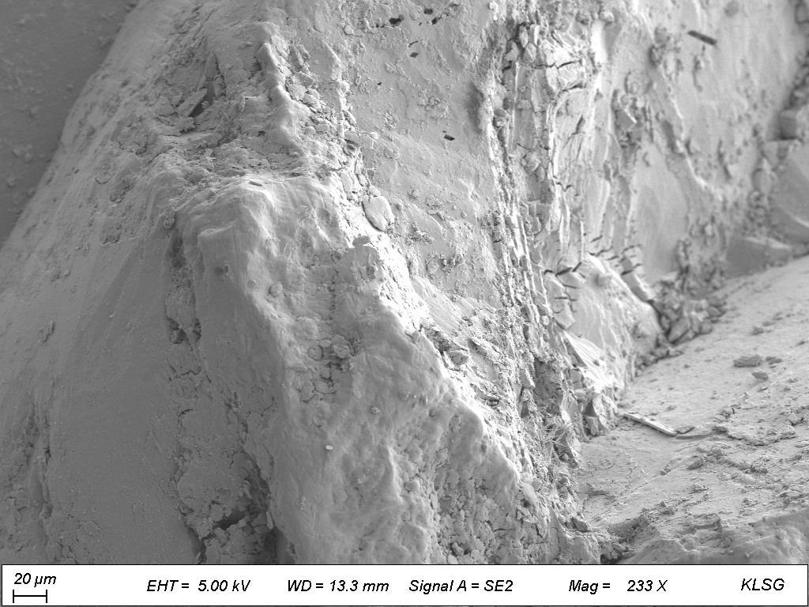
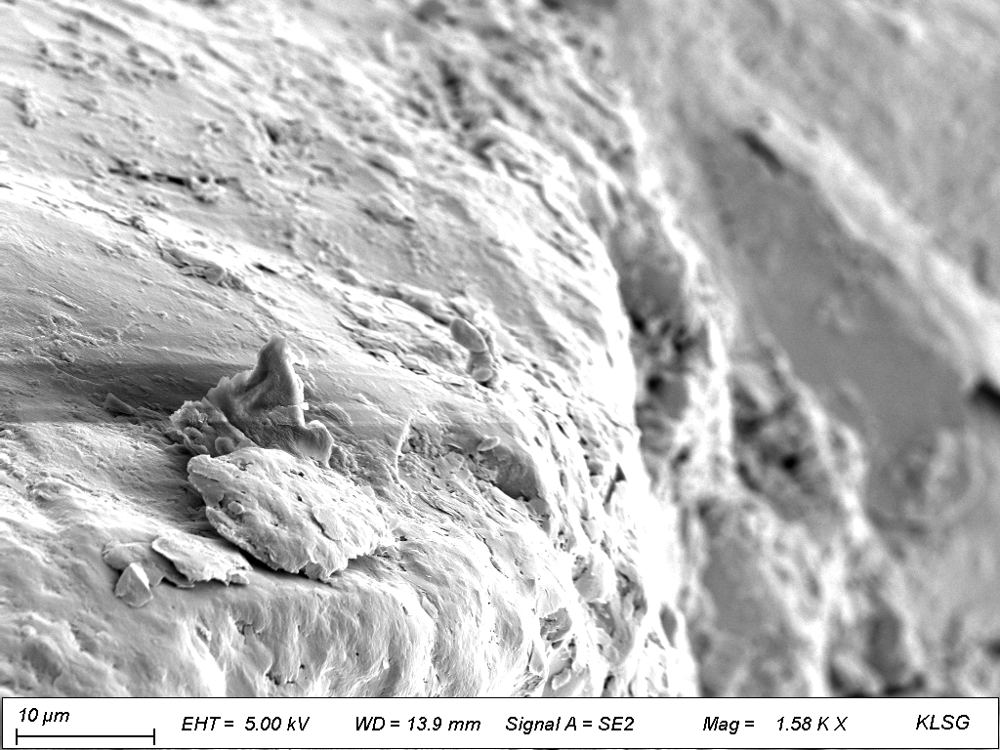
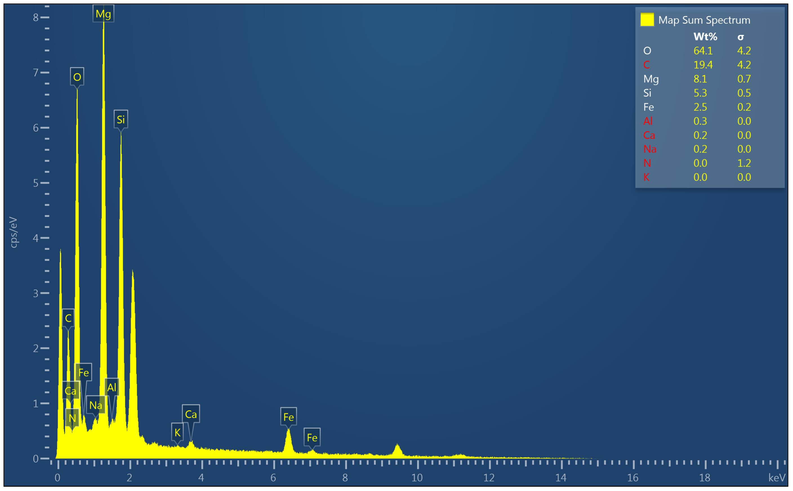
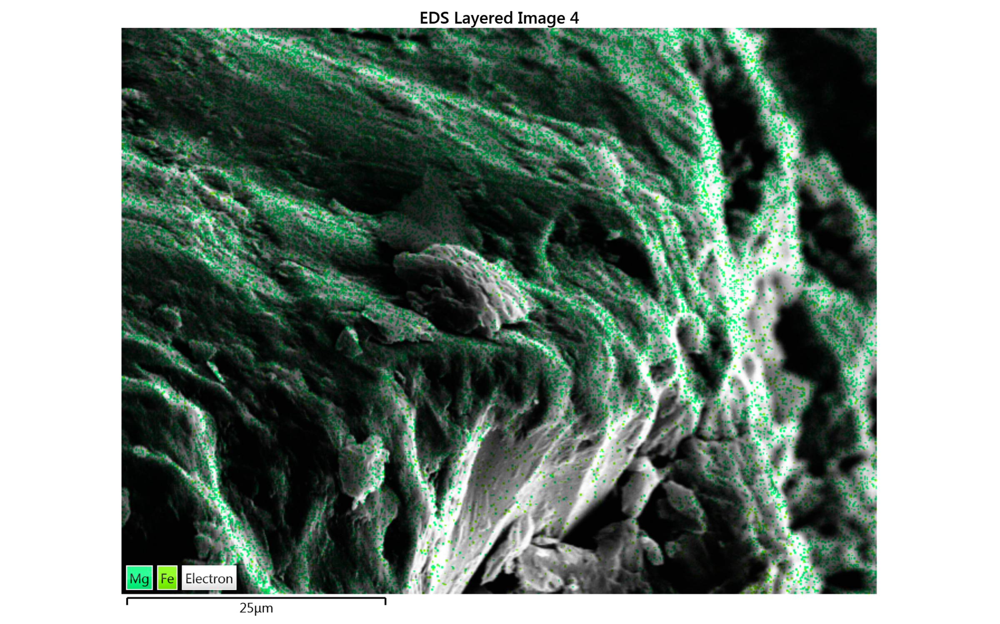
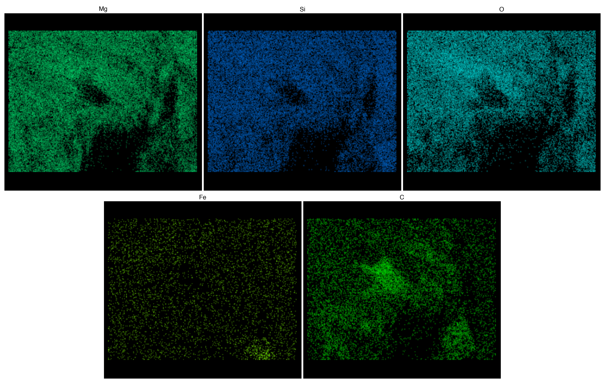

# 地球化学分析技术实验报告
> Coursework artifact · Nanjing University · 2026  
> Original course module: Analytical Geochemistry laboratory · SEM imaging and EDS analysis of olivine

## 实验三：扫描电子显微镜（SEM）— 橄榄石的二次电子形貌与能谱成分分析

**实验人：** 杜鑫宇  
**实验日期：** 2026年5月13日  
**课程：** 地球化学分析技术

---

## 1. 实验目的

- 了解扫描电子显微镜（SEM）的基本结构和工作原理
- 掌握二次电子成像（SEI）在矿物微观形貌观察中的应用
- 学习能谱分析（EDS）的基本原理及其在矿物成分半定量分析中的应用
- 通过对橄榄石样品的观察与测试，理解矿物微观形貌与成分特征的关系

---

## 2. 仪器原理简述

### 2.1 扫描电子显微镜（SEM）工作原理

扫描电子显微镜利用聚焦的高能电子束在样品表面进行逐点扫描，通过检测电子与样品相互作用产生的各种信号来获取样品信息。主要信号包括：

- **二次电子（SE）：** 来自样品表层约 10 nm 范围内，对表面形貌极其敏感，是观察微观形貌的主要信号
- **背散射电子（BSE）：** 来自样品较深区域（约 1 μm），其产率与样品原子序数有关，原子序数越大图像越亮，常用于成分衬度成像
- **特征 X 射线：** 用于成分分析，通过 EDS（能谱仪）检测

SEM 的基本结构包括电子枪、聚光镜和物镜组成的电磁透镜系统、扫描线圈、样品室以及各类信号探测器（如 SE 探测器、BSE 探测器、EDS 探测器）。

### 2.2 能谱分析（EDS）原理

EDS 利用样品在电子束轰击下产生的特征 X 射线进行成分分析。不同元素具有特定的特征 X 射线能量（如 Mg Kα 约 1.254 keV，Si Kα 约 1.740 keV，Fe Kα 约 6.403 keV），通过检测这些 X 射线的能量和强度，可进行元素的定性识别和半定量含量计算。

定量分析通常采用 ZAF 校正或 Phi-Rho-Z 方法，对原子序数效应、X 射线吸收效应和荧光效应进行修正，将原始计数率转换为可靠的质量百分比。

---

## 3. 样品简述

### 3.1 样品信息

- **矿物类型：** 橄榄石（Olivine, (Mg,Fe)₂SiO₄），选取自课程提供的共用样品
- **样品来源：** 老师直接提供

### 3.2 样品前处理

实验中共六个样品同时固定在样品台上进行前处理，本人选取其中一颗橄榄石作为测试对象。为增强样品导电性、防止电子束照射下电荷积累影响成像质量，样品表面进行了铂（Pt）镀膜处理。

### 3.3 实验条件

实验所用仪器为 ZEISS Gemini 系列扫描电子显微镜，具体工作条件如下：

| 参数 | 图 1（低倍） | 图 2（高倍） |
|------|------------|------------|
| 加速电压（EHT） | 5.00 kV | 5.00 kV |
| 工作距离（WD） | 13.3 mm | 13.9 mm |
| 探测器 | SE2 | SE2 |
| 放大倍数 | 233 × | 1.58 K × |
| 标尺 | 20 μm | 10 μm |

---

## 4. 结果和分析

### 4.1 二次电子成像（SEI）—— 形貌观察

本次实验拍摄了两张不同放大倍数的二次电子像。整体形貌呈灰白色调，表面凹凸起伏，类似山峰地形的起伏特征，反映出橄榄石颗粒在自然结晶或破碎过程中形成的复杂微观表面。

**图 1（233×，标尺 20 μm）：** 该图为橄榄石颗粒的整体形貌像。视野中可见一个完整的、山峰状的颗粒主体，表面起伏剧烈，呈灰白色。颗粒周围散布着细小的碎屑和起伏地形。

**图 2（1.58 K×，标尺 10 μm）：** 该图为颗粒东侧山脊区域的局部放大像。放大后可见山脊两侧的坡度变化，表面保持了灰白色的粗糙质感。

橄榄石属斜方晶系，具有不完全解理，本样品中观察到的起伏山脊状形貌与其结晶习性相符。

### 4.2 能谱分析（EDS）—— 元素成分

#### 4.2.1 面扫总谱（Map Sum Spectrum）

对样品表面进行面扫描分析，获得的元素定量数据如下（已扣除仪器本底）：

| 元素 | Wt% | σ（误差） |
|------|------|----------|
| C | 64.1 | 4.2 |
| O | 16.4 | 4.2 |
| Mg | 8.1 | 0.7 |
| Si | 5.3 | 0.5 |
| Fe | 2.5 | 0.2 |
| Al | 0.3 | 0.0 |
| Ca | 0.2 | 0.0 |
| Na | 0.2 | 0.0 |

#### 4.2.2 谱峰特征

能谱图显示镁（Mg）、氧（O）、硅（Si）三个主峰最为显著。值得注意的是，谱峰高度顺序为 Mg > O > Si，而经 ZAF 校正后的重量百分比顺序为 O（16.4 wt%）> Mg（8.1 wt%）> Si（5.3 wt%）。

这一差异源于轻元素（如 O）的 X 射线能量较低（O Kα 约 0.525 keV），在样品和探测器窗中易被吸收，探测效率低于 Mg Kα（约 1.254 keV）。ZAF 校正对此进行了修正，给出了更接近真实浓度的重量百分比。这一现象在 EDS 半定量分析中十分常见，说明了定量校正的必要性。

#### 4.2.3 元素分布特征

元素面分布图显示，各元素在样品表面的分布总体上趋势一致，但并非完全均匀。其中两个值得关注的细节：

**碳富集区域：** 样品表面某凸起区域碳含量异常偏高，对应 Mg、O、Si 含量偏低，推测为固定样品用的导电碳胶带碎片或含碳污染物附着于样品表面所致，并非样品自身成分。

**山脊地形区的信号衰减：** 样品中下部山脊状区域的各元素信号均较周围区域偏弱，这不是成分差异，而是地形效应——山脊的陡峭坡面使得部分特征 X 射线在出射过程中被样品自身遮挡，探测器无法全部接收，导致计数偏低。

此外，Fe 含量较低（2.5 wt%），表明该橄榄石以镁橄榄石端元为主；Al（0.3 wt%）、Ca（0.2 wt%）、Na（0.2 wt%）作为微量元素存在，属于橄榄石中常见的微量杂质元素。

**元素面分布图：** 图4为Mg（绿）、Fe（浅绿）的叠加分布图，整体分布趋势一致。图5为各元素单点分布图的合成。

---

## 5. 讨论

### 5.1 橄榄石微观形貌特征

二次电子像显示该橄榄石颗粒呈灰白色的山地貌，表明其表面经历了较为强烈的破碎或解理过程。这种粗糙表面是橄榄石在应力作用下沿解理或裂隙发生破碎的典型特征。高倍放大下的山脊图像进一步印证了颗粒表面的不规则性和地形复杂性。

### 5.2 成分特征与 Fo 值

橄榄石的 Fo 值（镁橄榄石百分含量）是描述其成分特征的核心参数：

$$Fo = \frac{n_{\text{Mg}}}{n_{\text{Mg}} + n_{\text{Fe}}} \times 100\%$$

扣除碳的干扰后，对主要元素进行归一化并换算为摩尔比：

| 元素 | 归一化 Wt% | 摩尔质量 | 相对摩尔数 |
|------|-----------|---------|-----------|
| O | 49.7 | 16.00 | 3.106 |
| Mg | 24.5 | 24.31 | 1.008 |
| Si | 16.1 | 28.09 | 0.573 |
| Fe | 7.6 | 55.85 | 0.136 |

**基于本次半定量 EDS 数据得到的近似 Fo 估计：Fo ≈ 88**（Fo = 1.008 / (1.008 + 0.136) × 100%）

该 Fo 值属于镁橄榄石（Forsterite）范畴，镁含量远高于铁含量，属于镁质橄榄石，与地幔橄榄岩以及基性岩浆早期结晶的橄榄石常见成分范围（Fo 88–92）定性一致。需要强调的是，该估计基于 EDS 半定量数据：样品表面粗糙、碳基底/污染贡献、地形效应以及 EDS 自身的半定量性质，都限制了其作为精确定量矿物化学的能力；它不等同于 EPMA 级定量结果。Mg/Si 摩尔比为约 1.76，接近镁橄榄石（Mg₂SiO₄）的理论值 2.0。

### 5.3 地形效应对 EDS 分析的影响

元素分布图中观察到"山脊区域所有元素信号均偏低"的现象，直观反映了 SEM-EDS 分析中地形效应的影响。在平缓表面，特征 X 射线的出射路径最短，吸收最少，计数最可靠；而在陡峭表面或凸起边缘，X 射线出射路径增长，或被样品自身遮挡，导致计数偏低。这一现象提醒我们在 EDS 半定量分析中应尽量选择平坦区域进行分析。

### 5.4 峰高与校正浓度的差异

能谱图上 Mg 峰高于 O 峰，但校正后 O 的 wt% 高于 Mg，这一现象说明了 ZAF 定量校正的重要性。对于轻元素（Z < 11），其低能 X 射线在探测器窗吸收严重，原始峰高不能直接反映含量，必须借助校正模型才能获得准确数据。

---

## 6. 结论

- 通过 SEM 二次电子成像观察了橄榄石颗粒的微观形貌，表面呈灰白色起伏山地貌，反映了矿物自然结晶与破碎的特征。
- EDS 能谱分析确认主要元素为 O、Mg、Si，Fe 含量较低，微量元素含 Al、Ca、Na。扣除碳胶带基底信号后，基于半定量 EDS 数据得到近似 Fo 估计约为 88，属镁质橄榄石。
- 元素分布图揭示了碳污染来源及地形效应对 EDS 信号的影响，为正确定量解读提供了重要参考。
