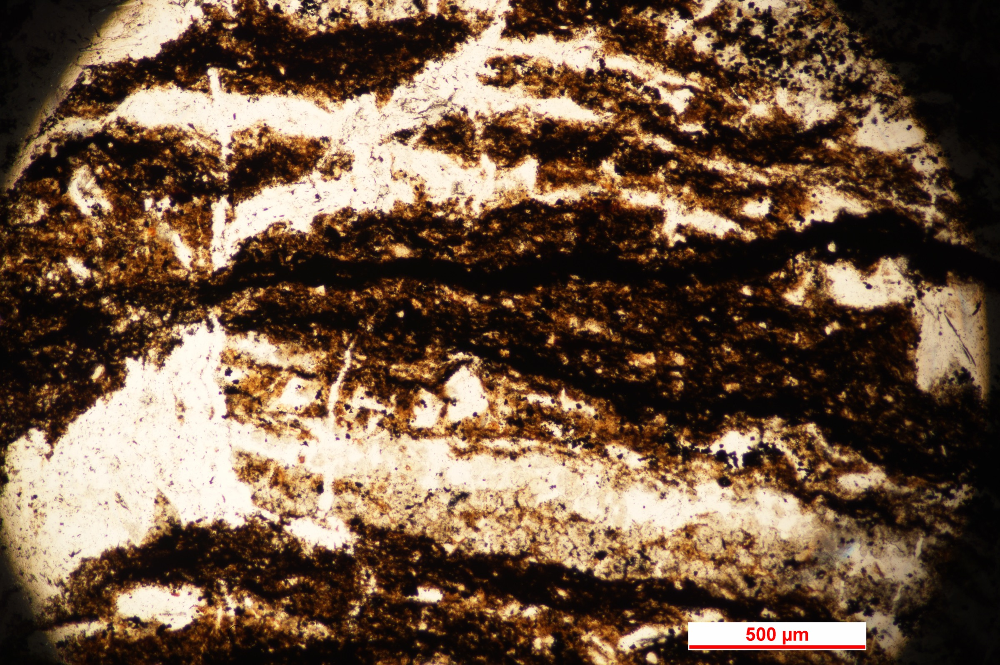
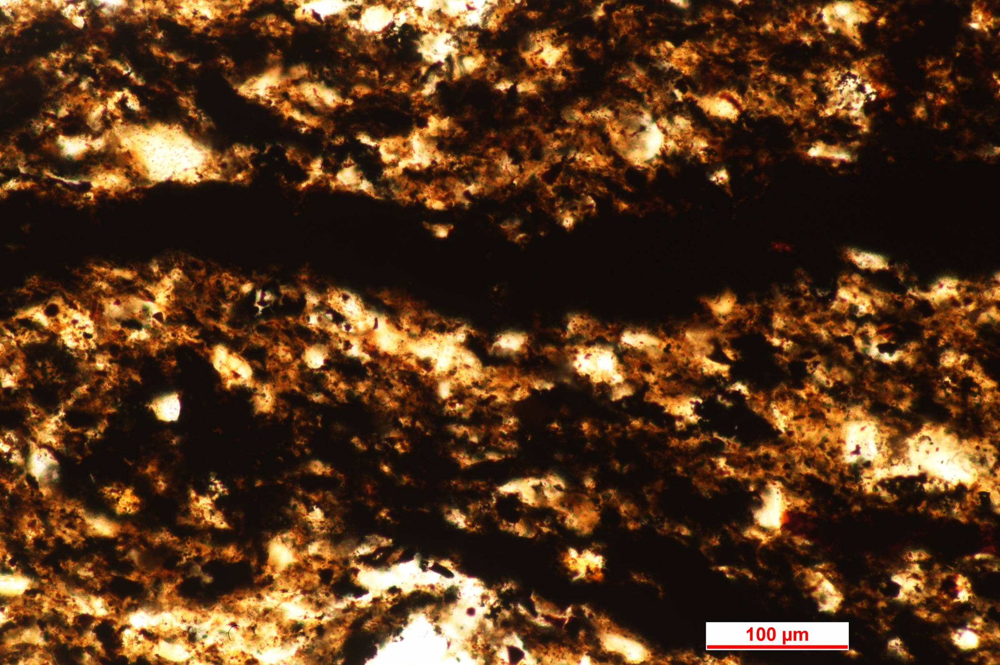
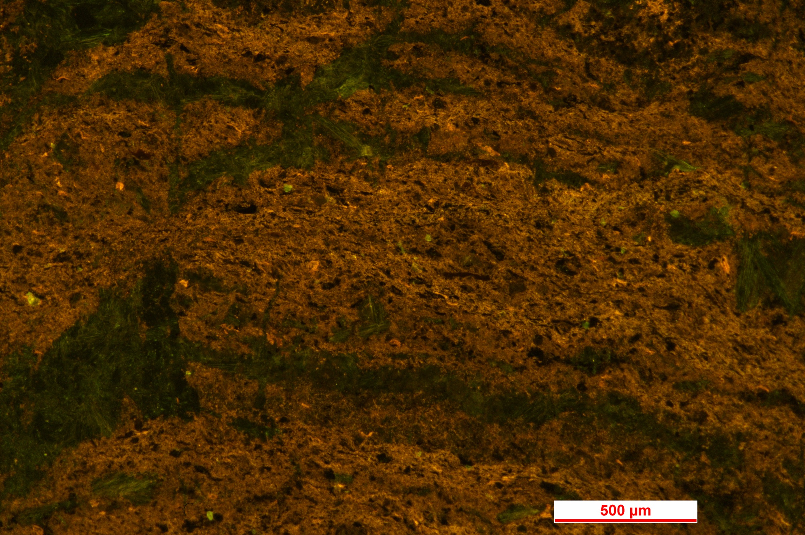
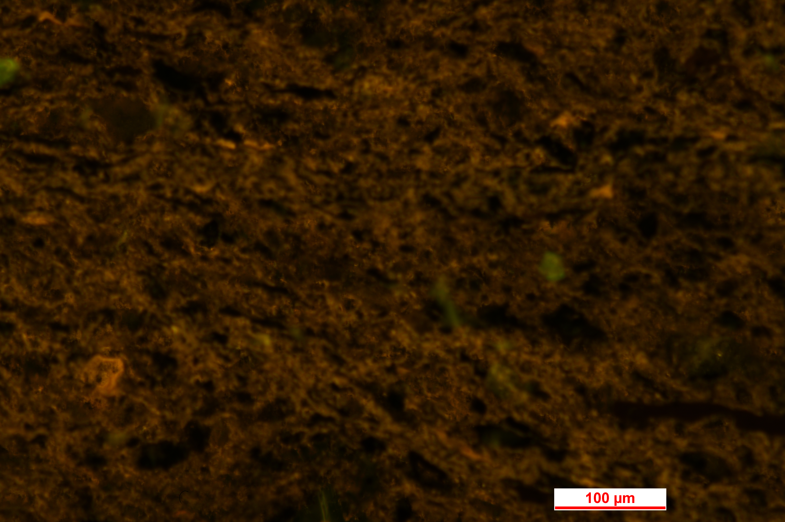
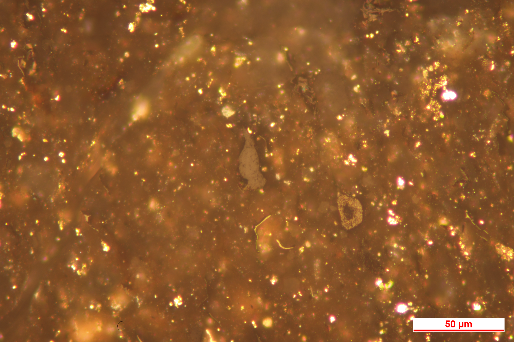
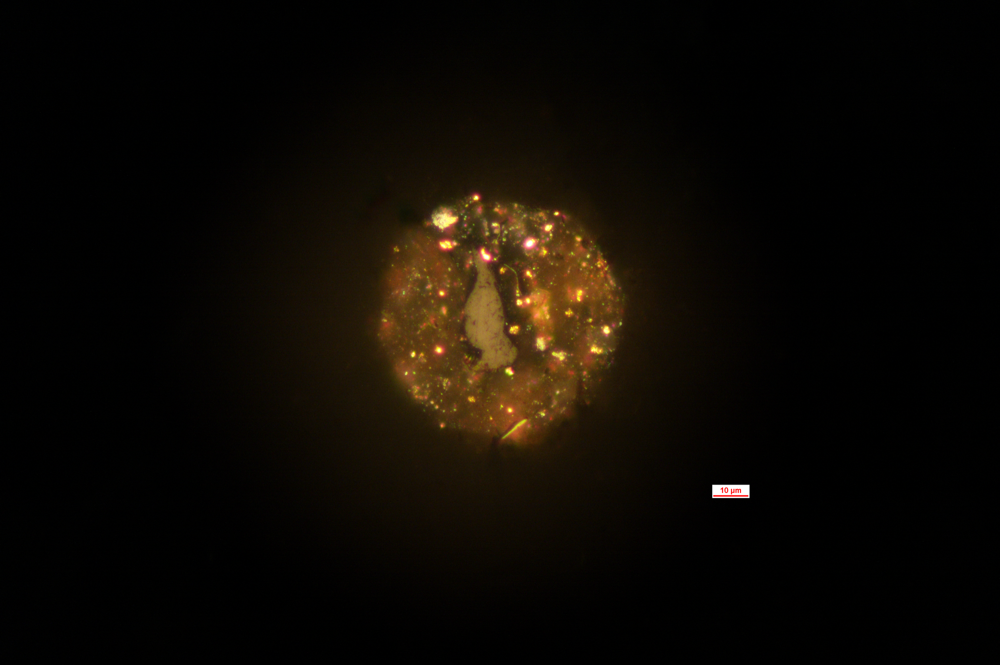

# 地球化学分析技术实验报告
> Coursework artifact · Nanjing University · 2026  
> Original course module: Analytical Geochemistry laboratory · organic petrography / source-rock maceral identification

## 实验一：烃源岩生烃母质鉴定——沉积有机质显微观察

**实验时间：** 2026年6月10日
**实验人：** 杜鑫宇
**实验目的：** 烃源岩生烃母质鉴定
**实验仪器：** Nikon ECLIPSE LV100N 光学显微镜

---

### 一、样品信息

| 样品 | 制片类型 | 观测内容 |
|------|---------|---------|
| 微生物席薄片（上午） | 透射光薄片 | 透射光、荧光下有机质纹层结构及碎屑颗粒分布 |
| 烃源岩抛光制片（下午） | 抛光制片 | 反射光（50×物镜）下有机显微组分识别 |

---

### 二、实验步骤

将制备好的微生物席岩石薄片置于 Nikon ECLIPSE LV100N 光学显微镜下，分别采用透射光和荧光模式进行观察。在5×物镜下观察样品整体纹层结构和有机质空间分布，在20×物镜下进一步观察有机质纹层、碎屑颗粒及其接触关系，并拍摄典型视域。

下午将烃源岩抛光制片置于显微镜下，在50×物镜反射光条件下观察有机显微组分，选择典型镜质体颗粒进行拍摄和形态描述。

---

### 三、实验结果

#### （1）岩石薄片透射光、荧光特征描述

**透射光特征：**

在5×物镜透射光下，样品表现出明显的层状或准层状构造。深褐色—黑色有机质条带与浅色、透明度较高的碎屑矿物层相互交替（图1），纹层总体近于平行，但边界呈波状起伏，局部出现厚度变化、分叉和不连续现象。深色层中有机质含量较高，浅色层中碎屑矿物含量较高，可能反映微生物席生长与外源碎屑沉积的交替作用。根据图中500 μm标尺粗略估算，单层厚度大致为数十至数百微米。

**图1 微生物席透射光显微照片，5×物镜，标尺500 μm**

在20×物镜高倍透射光下（图3），深色有机质主要呈连续或半连续的条带状、透镜状分布，透光性较弱。浅色碎屑颗粒多呈不规则状、次棱角状至次圆状，粒径不均。部分颗粒被暗色细粒基质或有机质包围，表现为基质支撑，颗粒之间常存在暗色物质分隔，但局部仍可见颗粒接触。无色透明碎屑矿物颗粒推测主要为石英。

**图3 微生物席透射光显微照片，20×物镜，标尺100 μm**

**荧光特征：**

在荧光条件下（图2、图4），样品整体呈黄褐色至暗褐色背景，局部可见绿色或黄绿色荧光较强区域。荧光响应主要呈斑块状、条带状及局部细长状分布，空间分布具有明显非均一性。荧光较强区域总体沿纹层方向分布，与透射光下有机质呈层状富集的总体特征相一致，说明不同纹层中有机质的组成、含量或保存状态可能存在差异。

**图2 微生物席荧光显微照片，5×物镜，标尺500 μm**

**图4 微生物席荧光显微照片，20×物镜，标尺100 μm**

#### （2）成烃生物形态学描述

**上午——微生物席纹层结构：**

显微镜下可见暗色有机质纹层与浅色碎屑矿物层交替排列的层状构造，纹层呈波状、局部分叉不连续。部分碎屑颗粒被暗色有机质或细粒基质包裹，呈基质支撑结构，反映微生物席对沉积颗粒的黏附、捕获和固定作用。荧光观察显示有机质的荧光响应呈斑块状、条带状及局部细长状分布。绿黄色区域具有相对较强的荧光响应，但其具体有机组分仍不能仅依据荧光颜色确定。

**下午——镜质体颗粒（50×物镜反射光）：**

视域中央可见一枚长条状至不规则片状镜质体颗粒（属镜质组，图5、图6）。根据图中标尺粗略估算，其长度约为30～40 μm。颗粒边界较清晰，与周围暗褐色细粒基质和亮色矿物颗粒存在明显的反射亮度差异；内部整体较均一，局部可见颜色和反射亮度略有变化。

**图5 烃源岩中镜质体颗粒的反射光整体视域，标尺50 μm**

*图5 烃源岩中镜质体颗粒的反射光整体视域，50×物镜。*

**图6 同一镜质体颗粒的反射光局部放大视图，标尺10 μm**

*图6 同一镜质体颗粒的反射光局部放大视图，50×物镜。*

#### （3）成烃母质来源鉴定

**上午样品：** 上午样品中可见暗色有机质纹层与浅色碎屑矿物层交替分布，并具有波状起伏、局部分叉和颗粒黏结等特征，综合鉴定为微生物席结构。其有机质母质主要来源于底栖微生物群落，可能包括蓝细菌等光合微生物，但仅依据本次显微照片尚不能鉴定到具体生物属种。

**下午样品：** 下午样品中识别出的长条状有机颗粒为镜质体颗粒，属镜质组。镜质体主要来源于陆源高等植物的木质和纤维组织，经腐殖化、凝胶化及后续热演化形成，表明样品中存在陆源高等植物有机质输入。

#### （4）母质生物的生活环境

微生物席通常形成于光照能够到达的浅水沉积环境，其胞外聚合物能够黏附和固定细粒碎屑物质。常见发育环境包括潮间带、滨浅湖、泻湖及浅海低能区域。样品中波状有机质纹层与碎屑层的交替，可能反映微生物生长与间歇性碎屑输入共同作用。

镜质体的原始母质来源于陆生高等植物，植物主要生活于陆地及滨岸湿地环境。植物残体经河流搬运、洪水输入或近距离沉积进入湖泊、三角洲、沼泽及近岸海域，随后发生腐殖化和保存。

#### （5）沉积环境判断

对上午微生物席样品而言，层状有机质结构、细粒碎屑沉积及微生物对颗粒的黏结作用，指示其可能形成于浅水、透光且水动力相对较弱的环境，并存在间歇性外源碎屑输入。具体属于海相还是湖相，仅凭显微结构无法确定。

对下午镜质体样品而言，镜质体颗粒说明存在陆源高等植物有机质输入，沉积位置可能受到陆源物质影响，但单颗镜质体颗粒不足以进一步确定其属于三角洲、湖泊、沼泽或海陆过渡相。需要结合岩性、沉积构造、其他显微组分组合及区域地质背景进行判断。

由于上午和下午观察的是不同样品，不能将两者直接组合为同一烃源岩的生物相或沉积环境。

#### （6）生油气潜力评价

微生物来源有机质在保存条件良好且有机质丰度较高时，通常具有一定生烃潜力。但本次仅观察到微生物席结构和荧光响应，尚不能据此定量判断其生油能力。

镜质体代表陆源腐殖型有机质输入，相较于富壳质组或富腐泥质有机质的样品，通常表现出相对偏生气的倾向。但镜质体颗粒的出现不能直接证明整个样品属于Ⅲ型干酪根，也不能据此确定总体油气产率。

两件样品的生烃潜力仍需结合总有机碳含量、岩石热解参数、干酪根类型、显微组分比例及镜质体反射率等指标进行综合评价。

---

## 实验二：沉积有机质热模拟实验

**实验时间：** 2026年6月10日
**实验人：** 杜鑫宇
**实验目的：** 了解沉积有机质热—压模拟仪的基本结构和工作原理，认识热模拟实验在烃源岩生烃研究中的应用
**实验仪器：** HX-III 型沉积有机质热—压模拟仪

---

### 1. 实验原理

沉积有机质在埋藏过程中随温压升高而逐渐成熟并生成油气。自然地质条件下这一过程持续数百万年，实验室热模拟通过提高温度并控制压力，使该过程在较短时间内发生。

参观的 HX-III 型沉积有机质热—压模拟仪利用密闭反应系统，在设定温压条件下对富有机质样品进行加热，模拟其在地层中的热演化及生烃、排烃过程。实验后可分别收集气态、液态和固态产物进行后续分析。

### 2. 仪器组成

本次参观的设备为 HX-III 型沉积有机质热—压模拟仪。整套装置主要由辅助压力机、立式加载与加热炉体、载压系统、静岩压力微控系统、生烃系统、排烃收集系统、计量系统以及控制与安全系统组成。

辅助压力机和立式加载机构用于向样品施加轴向载荷，载压系统可监测和调节主控压力与静岩压力，用于模拟有机质埋藏过程中受到的上覆压力。中部加热炉体为样品热演化提供受控温度条件，生烃系统分别监测炉膛温度、釜体温度和釜内压力。

排烃收集系统可监测真空压力、气体收集压力和排烃缓冲压力，并通过真空泵、冷阱、排烃阀和气量计等部件完成产物导出、冷凝和气体计量。计量系统采用触摸屏对超高压泵和气量计进行控制。设备还设有报警器、手动与自动控制选择及总电源等控制和安全部件。

本次实验以仪器参观和工作原理讲解为主，未实际完成装样、加热、加压和产物分析过程，因此不提供具体实验温度、压力和产率数据。

### 3. 操作流程介绍

参观中通过教师讲解了解到该仪器的主要操作流程：样品先经过破碎、筛分和称量，装入反应釜并密封；随后由控制系统设定目标温度、压力和升温程序，启动加热使样品发生热演化；反应结束后冷却卸压，依次收集气态产物、液态产物和固体残余物，用于后续地球化学分析。

### 4. 实验应用

热模拟实验可用于研究烃源岩在不同成熟阶段的生烃和排烃特征，分析产物组成随成熟度的变化。与显微组分鉴定结合，可比较镜质组、壳质组等不同母质的生烃差异，提高烃源岩评价的可靠性。

### 5. 安全注意事项

热—压模拟实验在高温、高压条件下进行。实验开始前应检查反应釜、管路、阀门及密封部件是否完好，并确认温度和压力传感器工作正常。升温和加压过程中不得超过仪器额定参数，应持续监测温度与压力变化。实验结束后必须待系统充分冷却，并缓慢卸压至安全状态后方可开启反应釜，防止残余高温和高压造成危险。
