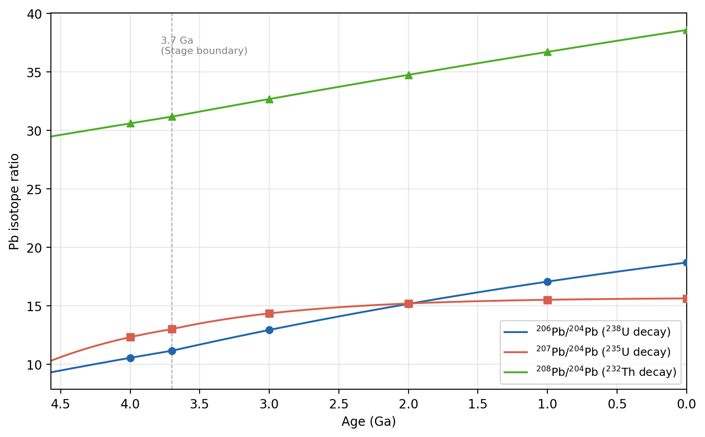
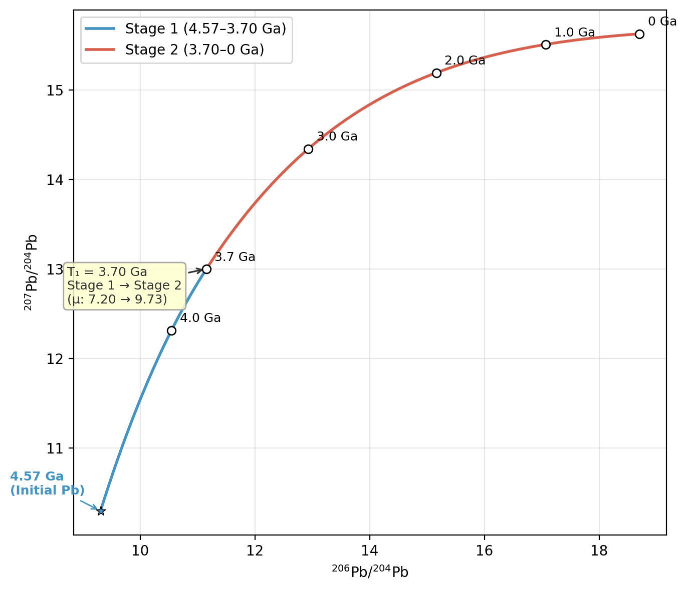

# U-Pb 同位素年代学思考题
> Coursework artifact · Nanjing University · 2026  
> Original course module: Isotope Geochemistry · HW5 · common Pb (Stacey–Kramers) evolution

## 1. 岩石 U-Pb 等时线为什么较难获得

U-Pb 等时线比 Rb-Sr、Sm-Nd 等时线更难获取，原因在于 U-Pb 体系本身的特殊性：

- U 和 Pb 活动性差异大。U 在氧化环境下易迁移，Pb 在热液或变质事件中容易丢失。体系一旦被扰动，初始条件不再满足，等时线就建不起来
- 理想的 U-Pb 定年需要高 U/Pb 比的副矿物（锆石、榍石等），且要求矿物晶格完整无缺陷。锆石若有微裂隙或辐射损伤，Pb 会扩散丢失，测出的年龄偏年轻
- 锆石中普通 Pb 含量极低（ppt-ppb 量级），需要 TIMS 或 LA-ICP-MS 级精度才能分辨微小比值差异，测量误差会放大年龄不确定度

## 2. U-Pb 等时线与 Pb-Pb 等时线对比

Pb-Pb 等时线的主要优点：

- 不受初始 U/Pb 比值变化影响。Pb-Pb 方法仅利用 Pb 同位素之间的关系（如 $^{207}\mathrm{Pb}/^{204}\mathrm{Pb}$ vs $^{206}\mathrm{Pb}/^{204}\mathrm{Pb}$），不需要测定 U 含量，因此避免了 U/Pb 比值误差带来的影响
- 当 U 含量难以准确测定或 U 已发生迁移时，仅凭 Pb 同位素组成仍可获取年龄信息
- 相对于 U-Pb 年龄，Pb-Pb 年龄通常具有更好的抗 Pb 丢失能力。单次 Pb 丢失对 $^{207}\mathrm{Pb}/^{206}\mathrm{Pb}$ 的影响小于对 $^{206}\mathrm{Pb}/^{238}\mathrm{U}$

两者前提条件一致（封闭体系、同源、相同初始 Pb 组成），但 Pb-Pb 等时线排除了 U/Pb 比这个额外变量：U-Pb 等时线需要同时知道 $^{238}\mathrm{U}/^{204}\mathrm{Pb}$ 和 $^{235}\mathrm{U}/^{204}\mathrm{Pb}$，而 U/Pb 比极易受后期事件干扰；Pb-Pb 等时线只靠 Pb 同位素比值，少一个假设自由度，误差传递更小。

## 3. 锆石 U-Pb 一致曲线与不一致直线

一致曲线 (Concordia)：系统封闭，无 Pb 丢失或 U 流失/加入，$^{206}\mathrm{Pb}/^{238}\mathrm{U}$ 和 $^{207}\mathrm{Pb}/^{235}\mathrm{U}$ 给出相同年龄。反映锆石原始结晶年龄。

不一致直线 (Discordia)：锆石经历部分 Pb 丢失或 U 迁移后，两个比值给出的年龄不一致，数据点沿 discordia 分布，与 Concordia 交于两点。上交点反映原始结晶年龄，下交点反映 Pb 丢失事件的时代（通常对应后期变质或热扰动）。

## 4. Stacey & Kramers (1975) 两阶段 Pb 演化模型

Stacey & Kramers (1975) 将地球 Pb 同位素演化分为两个阶段：第一阶段 4.57–3.70 Ga（µ₁ = 7.20, ω₁ = 32.09），第二阶段 3.70–0 Ga（µ₂ = 9.73, ω₂ = 36.91）。初始比值采用 Canyon Diablo 陨石值。

计算公式（以 $^{206}\mathrm{Pb}/^{204}\mathrm{Pb}$ 为例）：

$$
^{206}\mathrm{Pb}/^{204}\mathrm{Pb} = (^{206}\mathrm{Pb}/^{204}\mathrm{Pb})_0 + \mu (e^{\lambda_{238} T_{\mathrm{old}}} - e^{\lambda_{238} t})
$$

$\lambda_{238}=0.155125$, $\lambda_{235}=0.98485$, $\lambda_{232}=0.049475$ Ga$^{-1}$。$(^{206}\mathrm{Pb}/^{204}\mathrm{Pb})_0=9.307$，$(^{207}\mathrm{Pb}/^{204}\mathrm{Pb})_0=10.294$，$(^{208}\mathrm{Pb}/^{204}\mathrm{Pb})_0=29.476$。

各年龄点计算值：

| 年龄 (Ga) | $^{206}\mathrm{Pb}/^{204}\mathrm{Pb}$ | $^{207}\mathrm{Pb}/^{204}\mathrm{Pb}$ | $^{208}\mathrm{Pb}/^{204}\mathrm{Pb}$ |
| :-------: | :-----------------------------------: | :-----------------------------------: | :-----------------------------------: |
| 4.0 | 10.544 | 12.313 | 30.599 |
| 3.7 | 11.152 | 12.998 | 31.177 |
| 3.0 | 12.930 | 14.343 | 32.683 |
| 2.0 | 15.158 | 15.192 | 34.745 |
| 1.0 | 17.066 | 15.509 | 36.709 |
| 0 | 18.699 | 15.627 | 38.577 |

上图为三种 Pb 同位素比值从 4.57 Ga 到现在的演化曲线，灰色虚线标出 3.70 Ga 的阶段分界。$^{207}\mathrm{Pb}/^{204}\mathrm{Pb}$ 在早期斜率最大，因为 $^{235}\mathrm{U}$ 半衰期短，早期放射成因 Pb 产率高。

Pb-Pb 演化图，标注了各年龄点（含 4.57 Ga 初始 Pb）。曲线呈上凸弧形，反映 $^{235}\mathrm{U}$ 和 $^{238}\mathrm{U}$ 不同衰变速率的联合控制。两阶段分别以蓝色（Stage 1）和红色（Stage 2）表示，3.70 Ga 处 µ 从 7.20 跃升至 9.73，因此曲线在该点出现斜率变化。

Stacey & Kramers (1975) 两阶段模式认为，约 3.70 Ga 时地球发生了大规模地壳-地幔分异，使地幔残余体的 U/Pb 和 Th/Pb 比值跃迁，从而形成现今观测到的 Pb 同位素演化轨迹。两阶段模型的意义在于它不是单纯的数学拟合——它对应了早期地球从初始均一地幔到地壳分异完成这个关键地质过程。
