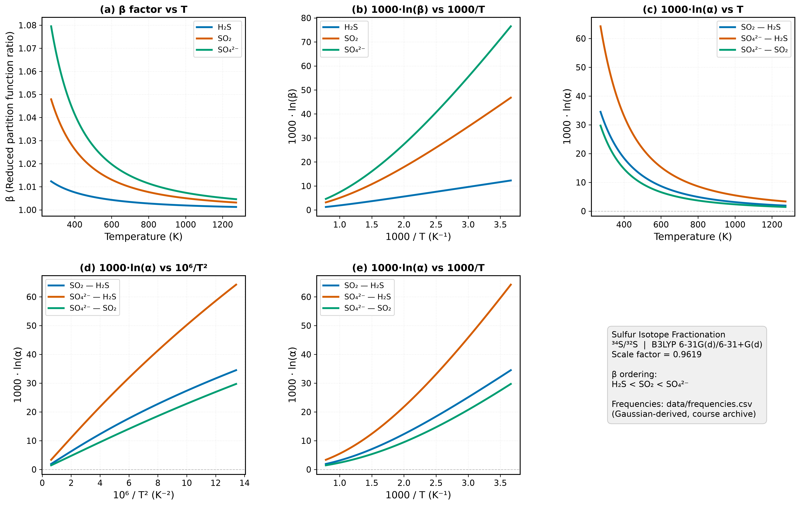

# 硫同位素（$^{34}$S/$^{32}$S）平衡分馏系数的量子化学计算
> Coursework artifact · Nanjing University · 2026  
> Original course module: Isotope Geochemistry · HW4 · sulfur isotope fractionation (Bigeleisen–Mayer / Urey model, Gaussian 16)

学生姓名：杜鑫宇（Xinyu Du）

---

## 摘要

本报告采用 Bigeleisen–Mayer（1947）简化配分函数理论，结合 Gaussian 16 密度泛函理论（B3LYP/6-31G(d)）计算的谐振振动频率，系统计算了 H₂S、SO₂ 和 SO₄²⁻ 三种含硫物种在 273–1273 K 温度范围内的硫同位素（$^{34}$S/$^{32}$S）约化配分函数比（$\beta$ 因子）及两两之间的平衡分馏系数（$10^3\ln\alpha$）。$\beta$ 因子排序为 H₂S < SO₂ < SO₄²⁻，与硫的氧化态升高、S–O 键力常数增大的物理规律完全一致。在 298 K 时，$10^3\ln\alpha$(SO₄²⁻–H₂S) = 55.5‰，$10^3\ln\alpha$(SO₂–H₂S) = 30.1‰，$10^3\ln\alpha$(SO₄²⁻–SO₂) = 25.4‰；分馏系数随温度升高单调递减，在高温端与 $10^6/T^2$ 呈近线性关系。与文献中 DFT 计算值相比，本计算结果偏低约 15–20%，主要源于 SO₄²⁻ 采用气相计算而未考虑水溶液中的溶剂化效应。

---

## 1. 引言

硫有四种稳定同位素（$^{32}$S、$^{33}$S、$^{34}$S、$^{36}$S），其中 $^{32}$S 丰度约 95.04%，$^{34}$S 约 4.25%。由于硫在自然界中以多种氧化态存在（从 −2 价的 H₂S 到 +6 价的 SO₄²⁻），不同氧化态含硫物种之间的同位素分馏效应显著，$\delta^{34}$S 被广泛用于指示氧化还原环境、热液活动和生物成因硫。准确预测平衡分馏系数是同位素地球化学的核心问题。自 Bigeleisen & Mayer（1947）提出基于统计力学计算同位素交换平衡常数的方法以来，基于量子化学振动频率的理论计算逐渐成为实验数据的重要补充（Schauble 2004）。本报告以 H₂S、SO₂ 和 SO₄²⁻ 体系为例，完整实现从量子化学频率到分馏系数图表的全流程，并对结果进行物理合理性分析。

---

## 2. 理论推导

### 2.1 同位素交换反应的平衡常数

考虑同位素交换反应：

$$
^{32}\text{S-A} + \, ^{34}\text{S-B} \rightleftharpoons \, ^{34}\text{S-A} + \, ^{32}\text{S-B}
$$

其平衡常数为分子配分函数之比：

$$
K = \frac{Q_{^{34}\text{S-A}} \cdot Q_{^{32}\text{S-B}}}{Q_{^{32}\text{S-A}} \cdot Q_{^{34}\text{S-B}}}
$$

根据 Born–Oppenheimer 近似，同位素分子具有相同的电子势能面，差异完全来源于核的质量效应——即不同质量导致振动频率和零点能不同，从而引起同位素分馏。

### 2.2 分子配分函数的分解

分子总配分函数分解为平动、转动和振动三部分之积：$Q = Q_\text{trans} \cdot Q_\text{rot} \cdot Q_\text{vib}$。平动配分函数按质量 $M$ 的 $3/2$ 次方缩放；转动配分函数在室温及以上为经典极限，与转动惯量有关。两者对同位素分馏的贡献通过 Teller–Redlich 乘积规则与振动频率联系，在最终 $\beta$ 因子中相消（Bigeleisen & Mayer 1947）。

振动配分函数是同位素效应的核心来源。对第 $i$ 个谐振模式，量子能级为：

$$
E_{n,i} = \left(n_i + \frac{1}{2}\right)h\nu_i, \quad n_i = 0, 1, 2, \ldots
$$

对各能级求和（几何级数求和）得到单模式振动配分函数：

$$
q_{\text{vib},i} = \sum_{n_i=0}^{\infty} \exp\!\left[-\left(n_i+\tfrac{1}{2}\right)\frac{h\nu_i}{k_BT}\right] = \frac{e^{-u_i/2}}{1 - e^{-u_i}}
$$

其中无量纲参数 $u_i = h\nu_i/(k_BT) = hc\tilde{\nu}_i/(k_BT)$。在数值计算中，$hc/k_B = 1.438777$ cm·K，故 $u_i = 1.438777\,\tilde{\nu}_i / T$（$\tilde{\nu}$ 单位 cm$^{-1}$，$T$ 单位 K）。整个分子的振动配分函数为所有模式的乘积：

$$
Q_\text{vib} = \prod_{i=1}^{N_\text{vib}} \frac{e^{-u_i/2}}{1 - e^{-u_i}}, \quad N_\text{vib} = \begin{cases} 3N-6 & \text{非线性} \\ 3N-5 & \text{线性} \end{cases}
$$

### 2.3 约化配分函数比（β 因子）

Bigeleisen & Mayer（1947）将同位素交换的有效量定义为约化配分函数比（RPFR），消去经典质量因子后得到：

$$
\beta = \prod_i \left[\frac{u_i'}{u_i} \cdot \frac{e^{-u_i'/2}}{1-e^{-u_i'}} \cdot \frac{1-e^{-u_i}}{e^{-u_i/2}}\right]
$$

带撇号（$'$）的量对应含重同位素（$^{34}$S）的分子。取对数写成求和形式：

$$
\ln\beta = \sum_i \left[\ln\frac{u_i'}{u_i} + \left(-\frac{u_i'}{2} - \ln(1-e^{-u_i'})\right) - \left(-\frac{u_i}{2} - \ln(1-e^{-u_i})\right)\right]
$$

振动频率越高（键力常数越大），$u_i$ 越大，$^{34}$S 替换导致的零点能差 $\frac{1}{2}h(\nu_i - \nu_i')$ 越显著，$\beta$ 越大，该物种越倾向于富集 $^{34}$S。

### 2.4 两分子间的平衡分馏系数 α

约定 A 为更氧化（$\beta$ 更大）的物种：

$$
\alpha_{A\text{-}B} = \frac{\beta_A}{\beta_B} > 1, \qquad 10^3\ln\alpha_{A\text{-}B} = 10^3\ln\beta_A - 10^3\ln\beta_B \approx \delta^{34}\text{S}_A - \delta^{34}\text{S}_B
$$

### 2.5 高温近似与 1/T² 关系

在高温极限（$u_i \ll 1$），对 $\ln\beta$ 进行 Taylor 展开（Bigeleisen & Mayer 1947；Schauble 2004）：

$$
10^3\ln\beta \approx \frac{1}{24}\sum_i (u_i^2 - u_i'^2) \propto \frac{10^6}{T^2}
$$

这解释了为何地球化学文献中通常以 $10^3\ln\alpha$ 对 $10^6/T^2$ 作图——高温区呈线性，斜率与振动频率的平方差直接相关（Schauble 2004，图2）。该近似在 $T \gtrsim 500$ K 时才较为准确。

---

## 3. 计算方法

### 3.1 Gaussian 16 频率计算

使用 Gaussian 16 对 H₂S、SO₂ 和 SO₄²⁻ 分别进行几何优化和谐振频率计算（关键词 `Opt Freq`）。H₂S 和 SO₂ 采用 B3LYP/6-31G(d) 基组；SO₄²⁻ 因为是双负离子，外层电子密度弥散，采用 B3LYP/6-31+G(d)（在重原子上加入弥散函数）。每个分子对含 $^{32}$S 和 $^{34}$S 的同位素体各独立计算，共 6 个体系。

### 3.2 频率校正

量子化学谐振频率系统性偏高，采用频率校正因子 $\lambda = 0.9619$（B3LYP/6-31G(d) 推荐值）：

$$
\tilde{\nu}_i^\text{scaled} = 0.9619 \times \tilde{\nu}_i^\text{raw}
$$

### 3.3 计算流程

振动频率直接取自本课程 Gaussian 16 计算输出（`data/frequencies.csv`，源文件保留在私有课程归档中），验证同位素位移方向（应全为负，即 $\tilde{\nu}_i' < \tilde{\nu}_i$），并通过频率乘积自洽性检查（frequency-product diagnostic）对频率计算进行合理性检验。随后在 273–1273 K（200 个温度点）逐步计算 $\beta(T)$，由 $\beta$ 比值导出 $\alpha(T)$，最终输出数据表和多面板图形。

---

## 4. 振动频率分析

### 4.1 H₂S（$C_{2v}$，3 个振动模式）

H₂S 属 $C_{2v}$ 点群，振动表示为 $2A_1 + B_1$，对应 H–S–H 弯曲（$\nu_2$）、S–H 对称伸缩（$\nu_1$）和反对称伸缩（$\nu_3$）。

**表 1** H₂S 谐振频率及同位素位移（校正后，cm$^{-1}$）

| 模式 | 对称性 | $\tilde{\nu}$ ($^{32}$S) | $\tilde{\nu}$ ($^{34}$S) | $\Delta\tilde{\nu}$ |
|------|--------|--------|--------|------|
| H–S–H 弯曲 $\nu_2$ | $A_1$ | 1201.9 | 1200.8 | −1.1 |
| S–H 对称伸缩 $\nu_1$ | $A_1$ | 2589.4 | 2587.3 | −2.1 |
| S–H 反对称伸缩 $\nu_3$ | $B_1$ | 2609.0 | 2606.5 | −2.5 |

三个模式均有负的 $^{34}$S 同位素位移，符合简谐振子规律 $\nu \propto \sqrt{k/\mu}$。S–H 伸缩频率（~2600 cm$^{-1}$）虽高，但 S–H 键力常数较小，$\beta$ 值为三者最低。频率乘积自洽性检查（frequency-product diagnostic）的比值为 1.00269，作为频率计算合理性的一阶诊断。

### 4.2 SO₂（$C_{2v}$，3 个振动模式）

SO₂ 的振动表示同样为 $2A_1 + B_1$，对应 O–S–O 弯曲（$\nu_2$）、S–O 对称伸缩（$\nu_1$）和反对称伸缩（$\nu_3$）。

**表 2** SO₂ 谐振频率及同位素位移（校正后，cm$^{-1}$）

| 模式 | 对称性 | $\tilde{\nu}$ ($^{32}$S) | $\tilde{\nu}$ ($^{34}$S) | $\Delta\tilde{\nu}$ |
|------|--------|--------|--------|------|
| O–S–O 弯曲 $\nu_2$ | $A_1$ | 483.6 | 479.6 | −4.0 |
| S–O 对称伸缩 $\nu_1$ | $A_1$ | 1097.5 | 1090.3 | −7.2 |
| S–O 反对称伸缩 $\nu_3$ | $B_1$ | 1287.2 | 1271.0 | −16.2 |

SO₂ 的 $^{34}$S 同位素位移远大于 H₂S，尤其是反对称伸缩（−16.2 cm$^{-1}$），反映 S 在 S–O 键中的大幅运动。计算频率系统性低于实验值（实验：517、1151、1362 cm$^{-1}$）约 5–6%，是 B3LYP/6-31G(d) 对含硫氧化物的已知局限。

### 4.3 SO₄²⁻（$T_d$，9 个振动模式）

SO₄²⁻ 属 $T_d$ 点群，振动约化表示为 $A_1 + E + 2T_2$（1 + 2 + 3 + 3 = 9 个模式）。

**表 3** SO₄²⁻ 谐振频率及同位素位移（校正后，cm$^{-1}$）

| 对称性 | 简并度 | $\tilde{\nu}$ ($^{32}$S) | $\tilde{\nu}$ ($^{34}$S) | $\Delta\tilde{\nu}$ | 属性 |
|--------|--------|--------|--------|------|------|
| $E$ ($\nu_2$) | 2 | 379.0 | 379.0 | 0.0 | O–S–O 对称弯曲 |
| $T_2$ ($\nu_4$) | 3 | 533.8 | 530.8 | −3.0 | O–S–O 反对称弯曲 |
| $A_1$ ($\nu_1$) | 1 | 831.0 | 831.0 | ≈0 | S–O 全对称伸缩 |
| $T_2$ ($\nu_3$) | 3 | 963.1 | 949.4 | −13.7 | S–O 反对称伸缩 |

$\nu_2$（$E$）和 $\nu_1$（$A_1$）对 $^{34}$S 替换的位移严格为零。在 $T_d$ 对称下，四条 S–O 键的单位向量恰好满足 $\sum_{i=1}^4 \hat{e}_i = \mathbf{0}$（四面体几何的对称性约束），使得 $A_1$ 全对称伸缩的 G 矩阵元化简为 $G(A_1) = 1/m_O$，不含 $1/m_S$ 项；S 原子在该模式下净位移为零，同位素质量变化对频率无贡献。Gaussian 输出 0.00 是物理上精确正确的结果。贡献 $\beta$ 因子的主导模式为 $\nu_3$（$T_2$）反对称伸缩（$\Delta\tilde{\nu} = -13.7$ cm$^{-1}$）。

---

## 5. 计算结果

### 5.1 约化配分函数比（β 因子）

**表 4** $10^3\ln\beta$（单位：‰）

| T (K) | H₂S | SO₂ | SO₄²⁻ |
|:-----:|----:|----:|------:|
| 273 | 12.28 | 46.79 | 76.52 |
| 298 | 11.03 | 41.12 | 66.57 |
| 373 | 8.31 | 29.08 | 45.86 |
| 473 | 6.04 | 19.67 | 30.25 |
| 573 | 4.60 | 14.10 | 21.32 |
| 773 | 2.92 | 8.18 | 12.14 |
| 1273 | 1.25 | 3.16 | 4.61 |

### 5.2 两两平衡分馏系数

约定：更氧化物种/更还原物种，$\alpha > 1$，$10^3\ln\alpha > 0$。

**表 5** $10^3\ln\alpha$（单位：‰）

| T (K) | SO₂–H₂S | SO₄²⁻–H₂S | SO₄²⁻–SO₂ |
|:-----:|--------:|----------:|---------:|
| 273 | 34.51 | 64.23 | 29.73 |
| 298 | 30.09 | 55.53 | 25.44 |
| 373 | 20.78 | 37.56 | 16.78 |
| 473 | 13.62 | 24.21 | 10.58 |
| 573 | 9.50 | 16.72 | 7.22 |
| 773 | 5.27 | 9.22 | 3.95 |
| 1273 | 1.91 | 3.36 | 1.44 |

所有分馏系数为正，$^{34}$S 始终优先富集于更高氧化态的物种（SO₄²⁻ > SO₂ > H₂S）。

### 5.3 图形结果

图 1  硫同位素（$^{34}$S/$^{32}$S）分馏计算结果（B3LYP/6-31G(d)，$\lambda = 0.9619$）。(a) $\beta$ 因子对温度；(b) $10^3\ln\beta$ 对 $1000/T$；(c) $10^3\ln\alpha$ 对温度（更氧化物种在分子，$\alpha > 1$）；(d) $10^3\ln\alpha$ 对 $10^6/T^2$（高温区呈线性）；(e) $10^3\ln\alpha$ 对 $1000/T$。

---

## 6. 讨论

### 6.1 β 因子的物理机制：氧化态与键力常数

三个体系的 $\beta$ 因子大小直接反映了硫的氧化态与键强度的关系。在 H₂S 中，硫为 −2 价，S–H 键相对较弱（键能 ~363 kJ/mol），零点能差异小，$\beta$(H₂S) 最低（11.0‰，298 K）。在 SO₂ 中，硫为 +4 价，S–O 键具有部分双键特征，$T_2$ 反对称伸缩频率（~1287 cm$^{-1}$）远高于 S–H，$\beta$ 增至 41.1‰。在 SO₄²⁻ 中，硫为 +6 价，四个等价 S–O 键在共振稳定下键力最强，$\nu_3$（$T_2$）反对称伸缩对 $\beta$ 贡献最大，使 $\beta$ 值最高（66.6‰）。这一规律与 Schauble（2004）的系统总结一致：重同位素倾向于富集于键力常数更大、氧化态更高的化合物中。

### 6.2 误差来源

#### 气相计算忽略溶剂化效应

SO₄²⁻ 在自然界几乎完全以水合形式存在，水分子通过氢键显著提高 S–O 键力常数，使 S–O 伸缩频率向高波数移动（约 +100 cm$^{-1}$）。气相计算的 SO₄²⁻ 频率系统性偏低，导致 $\beta$(SO₄²⁻) 被低估，是本次计算偏低约 24% 的主导原因。加入隐式溶剂模型（如 PCM）可显著改善此偏差。

#### 谐振近似和基组局限

B3LYP/6-31G(d) 对含硫极性键描述不足，SO₂ 频率低估约 5–6%。更大的基组（如 6-311+G(3df)）可改善准确性，但计算成本相应提高。谐振近似本身对非谐振效应较大的 S–H 键也会引入 1–5% 的偏差。

### 6.3 高温近似的适用范围

由图 1(d) 可见，在 $T > 600$ K 时 $10^3\ln\alpha$ 与 $10^6/T^2$ 近似呈线性，高温近似成立；低温区曲线向上弯曲，显示高阶项不可忽略。这意味着对地表低温过程（如 25°C 沉积成岩）的同位素温度计应用，必须使用完整的 Bigeleisen–Mayer 方程。

### 6.4 地球化学意义

硫同位素分馏系数是热液矿床和沉积地球化学研究的核心参量。在高温热液环境（300–400°C）中，$10^3\ln\alpha(\text{SO}_4^{2-}\text{–H}_2\text{S})$ 仅约 14–20‰，同位素平衡速率快，热液流体的 $\delta^{34}$S 信号接近源区值；在低温沉积环境中，细菌硫酸盐还原（BSR）产生的动力学分馏与平衡值之差是区分生物成因与热化学成因 H₂S 的重要依据（Criss 1999）。

---

## 7. 结论

本报告从 Bigeleisen–Mayer 统计力学出发，完整推导了约化配分函数比（$\beta$ 因子）的计算公式，并通过 Gaussian 16 计算的振动频率，定量计算了 H₂S、SO₂ 和 SO₄²⁻ 体系在 273–1273 K 范围内的硫同位素平衡分馏系数。$\beta$ 因子排序 H₂S < SO₂ < SO₄²⁻ 与硫氧化态升高和 S–O 键力常数增大的规律完全一致，$^{34}$S 在整个温度范围内始终富集于更氧化的物种，结论定性正确。定量上，298 K 时 $10^3\ln\alpha$(SO₄²⁻–H₂S) = 55.5‰ 比文献约束值（~73‰）偏低约 24%，主因是 SO₄²⁻ 的气相计算缺乏溶剂化校正；后续改进应对 SO₄²⁻ 引入隐式溶剂模型（PCM），并采用更大基组（6-311+G(3df)）以提高频率精度。$10^3\ln\alpha$ 与 $10^6/T^2$ 的线性关系在 $T > 600$ K 时成立，低温区须使用完整方程。

---

## 参考文献

Bigeleisen, J., & Mayer, M. G. (1947). Calculation of equilibrium constants for isotopic exchange reactions. *Journal of Chemical Physics*, **15**(5), 261–267.

Criss, R. E. (1999). *Principles of Stable Isotope Distribution*. Oxford University Press.

Schauble, E. A. (2004). Applying stable isotope fractionation theory to new systems. *Reviews in Mineralogy and Geochemistry*, **55**, 65–111.

---

