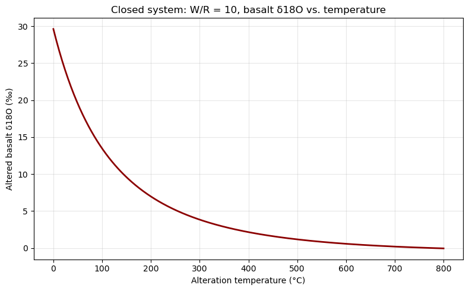
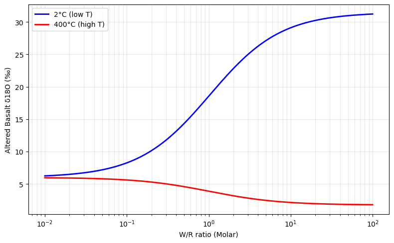

# 1. 氧同位素水岩比 (W/R) 计算
> Coursework artifact · Nanjing University · 2026  
> Original course module: Isotope Geochemistry · HW2 · water–rock exchange

*说明：本题 W/R 值的求解采用经典的 Taylor (1977) 质量平衡近似模型，即在同位素分馏较小的情况下，直接使用 $\delta$ 值进行线性质量守恒计算。*

### 1. 已知参数
*   岩石初始值 $\delta^{18}\text{O}_r^i$ = 6.5‰
*   岩石终值 $\delta^{18}\text{O}_r^f$ = -4.0‰
*   水初始值 $\delta^{18}\text{O}_w^i$ = -14.0‰
*   温度 $T_K$ = 500 + 273.15 = 773.15 K
*   钙长石摩尔分数 $An$ = 0.3

### 2. 斜长石-水氧同位素分馏系数 ($\Delta$)
由公式:
$$ \Delta = (2.91 - 0.76An)(10^6 T_K^{-2}) + (-3.41 - 0.14An) $$

代入计算得:
$$ \Delta = (2.91 - 0.76 \times 0.3) \times \frac{10^6}{773.15^2} + (-3.41 - 0.14 \times 0.3) = 1.0347\,\text{‰} $$

### 3. 封闭体系 W/R 比值

$$ (W/R)_{\text{closed}} = \frac{\delta^{18}\text{O}_r^f - \delta^{18}\text{O}_r^i}{\delta^{18}\text{O}_w^i - (\delta^{18}\text{O}_r^f - \Delta)} $$

代入计算:
$$ (W/R)_{\text{closed}} = \frac{-4.0 - 6.5}{-14.0 - (-4.0 - 1.0347)} = 1.1712 $$

### 4. 开放体系 W/R 比值

$$ (W/R)_{\text{open}} = \ln \left( \frac{\delta^{18}\text{O}_r^i - \delta^{18}\text{O}_w^i - \Delta}{\delta^{18}\text{O}_r^f - \delta^{18}\text{O}_w^i - \Delta} \right) $$

代入计算:
$$ (W/R)_{\text{open}} = \ln \left( \frac{6.5 - (-14.0) - 1.0347}{-4.0 - (-14.0) - 1.0347} \right) = 0.7753 $$

---

# 2. 闭合体系下玄武岩 $\delta^{18}\text{O}$-温度曲线（$W/R=10$）

### 1. 已知条件
* 初始玄武岩：$\delta_r^i = 6\,\text{‰}$
* 海水（假设为SMOW标准）：$\delta_w^i = 0\,\text{‰}$
* 水/岩比（氧原子摩尔比）：$W/R = 10$
* 分馏关系：
$$
\Delta_{\text{玄武岩-海水}} = 3.42\times10^6T^{-2} - 3.90\times10^3T^{-1}
$$

### 2. 公式推导

利用同位素质量守恒，定义相对于标准物质的归一化同位素比值为 $(R') = 1 + \delta/1000$。

根据同位素分馏系数的定义：
$$
\alpha = e^{\Delta/1000},\qquad (R')_r^f = \alpha \cdot (R')_w^f
$$

闭合体系下，体系整体同位素摩尔总量守恒（设初始岩石氧摩尔数为 1，水为 $W/R$）：
$$
(R')_r^i + (W/R)(R')_w^i = (R')_r^f + (W/R)(R')_w^f
$$

将 $(R')_w^f = (R')_r^f / \alpha$ 代入守恒方程，整理得：
$$
(R')_r^f = \frac{\alpha \cdot \left[ (R')_r^i + (W/R)(R')_w^i \right]}{(W/R) + \alpha}
$$

最后将计算得到的归一化比值 $(R')$ 换回 $\delta$ 表示：
$$
\delta_r^f = \left( (R')_r^f - 1 \right) \times 1000\,\text{‰}
$$

基于上述精确推导公式，代入给定参数，随开尔文温度 $T$ 变化计算可得到曲线如下。

---

# 3. 闭合体系下玄武岩 $\delta^{18}\text{O}$-水岩比曲线（2℃与400℃）

### 1. 已知条件
* 初始玄武岩：$\delta_r^i = 6\,\text{‰}$
* 海水（假设为SMOW标准）：$\delta_w^i = 0\,\text{‰}$
* 蚀变温度：$T_1 = 2^\circ\text{C}$ (275.15 K)；$T_2 = 400^\circ\text{C}$ (673.15 K)
* 分馏关系：
$$
\Delta_{\text{玄武岩-海水}} = 3.42\times10^6T^{-2} - 3.90\times10^3T^{-1}
$$

### 2. 公式推导

定义相对于标准物质的归一化同位素比值为 $(R') = 1 + \delta/1000$。

根据同位素分馏系数的定义：
$$
\alpha = e^{\Delta/1000},\qquad (R')_r^f = \alpha \cdot (R')_w^f
$$

闭合体系下，体系整体同位素摩尔总量守恒（设初始岩石氧摩尔数为 1，水为 $W/R$）：
$$
(R')_r^i + (W/R)(R')_w^i = (R')_r^f + (W/R)(R')_w^f
$$

将 $(R')_w^f = (R')_r^f / \alpha$ 代入守恒方程，整理得：
$$
(R')_r^f = \frac{\alpha \cdot \left[ (R')_r^i + (W/R)(R')_w^i \right]}{(W/R) + \alpha}
$$

最后将计算得到的归一化比值 $(R')$ 换回 $\delta$ 表示：
$$
\delta_r^f = \left( (R')_r^f - 1 \right) \times 1000\,\text{‰}
$$

基于上述精确推导公式，代入 $2^\circ\text{C}$ 和 $400^\circ\text{C}$ 对应的计算参数，以水/岩比值（$W/R$）为对数自变量进行正演计算，得到曲线如下。

