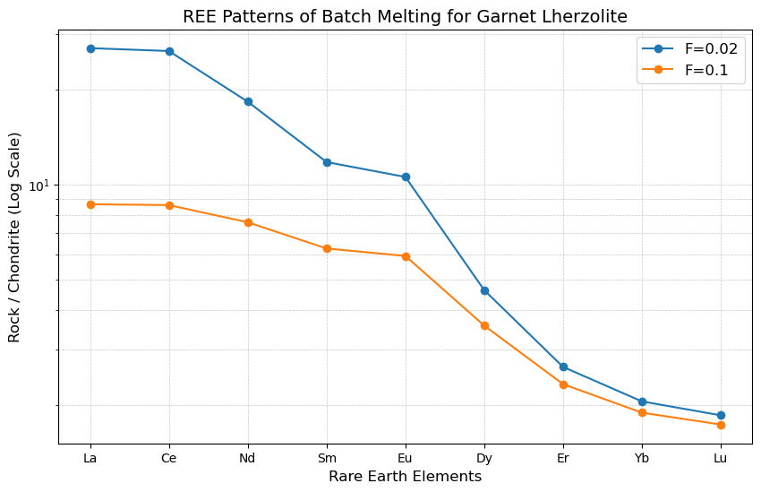
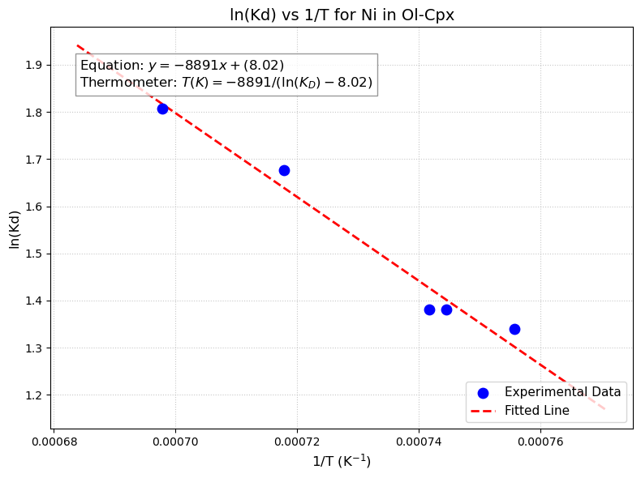
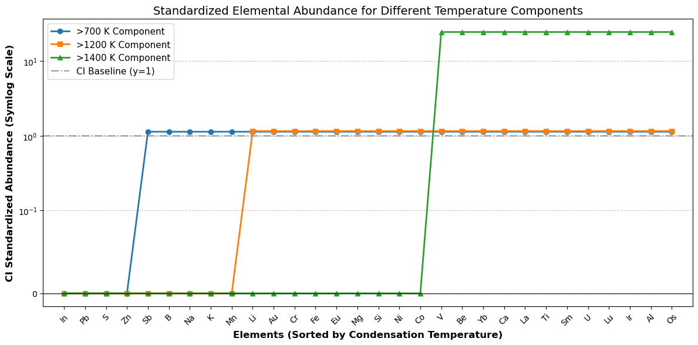
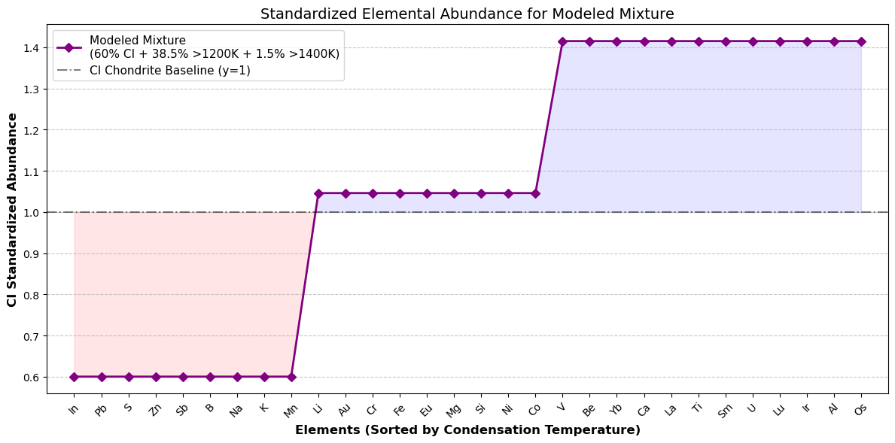

# Problem 3
> Coursework artifact · Nanjing University · 2026  
> Original course module: Planetary Chemistry · HW3 · chemical kinetics

杜鑫宇

## 1.类质同象

1）不可以：离子半径相差过大（0.15 Å和0.40 Å）。

2）不可以：离子核外电子构型不同，成键性质不同。$\text{Na}^{1+}$为8电子结构，倾向成纯粒子键，$\text{Cu}^{1+}$为18电子结构，倾向成共价键；同时离子半径相差也较大。

3）不可以：电价相差过大（3+和1+）。

## 2.分配系数和富集系数

1）根据总分配系数公式 $D = \sum (X_i \times D_i)$（其中 $X_i$ 为各矿物的质量分数，$D_i$ 为元素在该矿物中的分配系数），计算得出该地幔岩石发生部分熔融时，各稀土元素的总分配系数（$D$）如下：

| 元素 | **$D$** |
| :---: | :---: |
| La | 0.0174 |
| Ce | 0.0182 |
| Nd | 0.0354 |
| Sm | 0.0663 |
| Eu | 0.0763 |
| Dy | 0.2005 |
| Er | 0.3664 |
| Yb | 0.4770 |
| Lu | 0.5301 |

2）分别在熔融程度 F=0.02 和 F=0.1 时，熔体相对球粒陨石的富集系数（$C^l/C^0$）如下：

| 元素 | **F=0.02** | **F=0.10** |
| :---: | :---: | :---: |
| La | 27.02 | 8.65 |
| Ce | 26.46 | 8.60 |
| Nd | 18.28 | 7.58 |
| Sm | 11.77 | 6.26 |
| Eu | 10.56 | 5.93 |
| Dy | 4.62 | 3.57 |
| Er | 2.64 | 2.33 |
| Yb | 2.05 | 1.89 |
| Lu | 1.85 | 1.73 |

上述计算结果的稀土配分模式图如下所示：

## 3. 橄榄石和单斜辉石中Ni的分配与温度计方程

1）计算得到的 Ni 在橄榄石和单斜辉石之间的分配系数（$K_D = \text{Ni\_Ol} / \text{Ni\_cpx}$）补充填入表格如下：

| 样品号 | 温度(°C) | Ni_Ol, ppm | Ni_cpx, ppm | $\mathbf{K_D(Ol/cpx)}$ |
| :---: | :---: | :---: | :---: | :---: |
| 1 | 1160 | 1555 | 255 | 6.10 |
| 2 | 1120 | 1310 | 245 | 5.35 |
| 3 | 1075 | 955 | 240 | 3.98 |
| 4 | 1070 | 935 | 235 | 3.98 |
| 5 | 1050 | 840 | 220 | 3.82 |

2）根据微量元素分配的热力学方程（Van 't Hoff 方程）：
$$\ln(K_D) = \frac{-\Delta H}{R \cdot T} + \frac{\Delta S}{R}$$

将摄氏度转化为开尔文温度 $T(K)$ 后，令 $y = \ln(K_D)$，$x = 1/T(K)$ 进行线性回归拟合。拟合结果如下：
*   **斜率** $a = -\Delta H / R = -8891.07$
*   **截距** $b = \Delta S / R = 8.0213$
*   **判定系数** $R^2 = 0.9697$

将常数 $R = 8.3144\,\mathrm{J\,mol^{-1}\,K^{-1}}$ 代入，可求得该过程的焓变 $\Delta H = 73.92\,\mathrm{kJ\,mol^{-1}}$，熵变 $\Delta S = 66.69\,\mathrm{J\,mol^{-1}\,K^{-1}}$。

整理拟合参数，最终得出**橄榄石-单斜辉石矿物对 Ni 的温度计方程**为：
$$T(K) = \frac{-8891.07}{\ln(K_D) - 8.0213}$$

## 4. 太阳系元素丰度的归一化与冷凝温度分异

1）将提供的 30 种元素根据 CI 球粒陨石丰度重新归一化至 100%（原子百分比），并按冷凝温度从低到高进行排序，截取前5种挥发性最强的元素展示如下：

| 元素 (Element) | CI 丰度 | 冷凝温度 (Cond T. / K) | 归一化原子百分比 (CI_norm_100 / %) |
| :---: | :---: | :---: | :---: |
| **In** | 0.1779 | 470 | 0.000005 |
| **Pb** | 3.3320 | 520 | 0.000092 |
| **S** | 426600.0 | 648 | 11.768866 |
| **Zn** | 1212.0 | 684 | 0.033436 |
| **Sb** | 0.3126 | 912 | 0.000009 |

2）& 3）& 4）以归一化后的 CI 丰度为基础，分别生成了冷凝温度 **>700 K**、**>1200 K** 和 **>1400 K** 的三种组分。对各个组分进行再次归一化后，采用原 CI 丰度进行标准化校正。
（注：随着低冷凝温度挥发性元素的剥离，剩余体系中难熔元素的相对比例被等比例放大。例如在 >1400K 组分中，由于排除了巨量的 Mg、Si、Fe 等元素，残余的极难熔元素实现了约 24.6 倍的强烈富集。）

采用对数坐标轴绘制的标准化后丰度变化图如下：

5）假设一个样品由 **60% 的 CI 球粒陨石成分 + 38.5% 的 >1200 K 组分 + 1.5% 的 >1400 K 组分** 混合而成。
对混合体重新计算标准化丰度，得到的最终混合成分配分模式图如下：

**分析**：该混合模型的标准化图谱清晰地展示了挥发性元素（如 In, Pb, S, Zn 等冷凝温度 <1200 K 的元素）相对于 CI 球粒陨石的**亏损**（恒定在 0.6 倍）；而难熔元素（如 Ca, Al, Os 等冷凝温度 >1400 K 的元素）则表现出明显的阶梯状**富集**（最高可达 1.4 倍左右）。这种模式完美模拟了行星或陨石母体在早期太阳星云中的不完全冷凝与挥发分丢失过程。