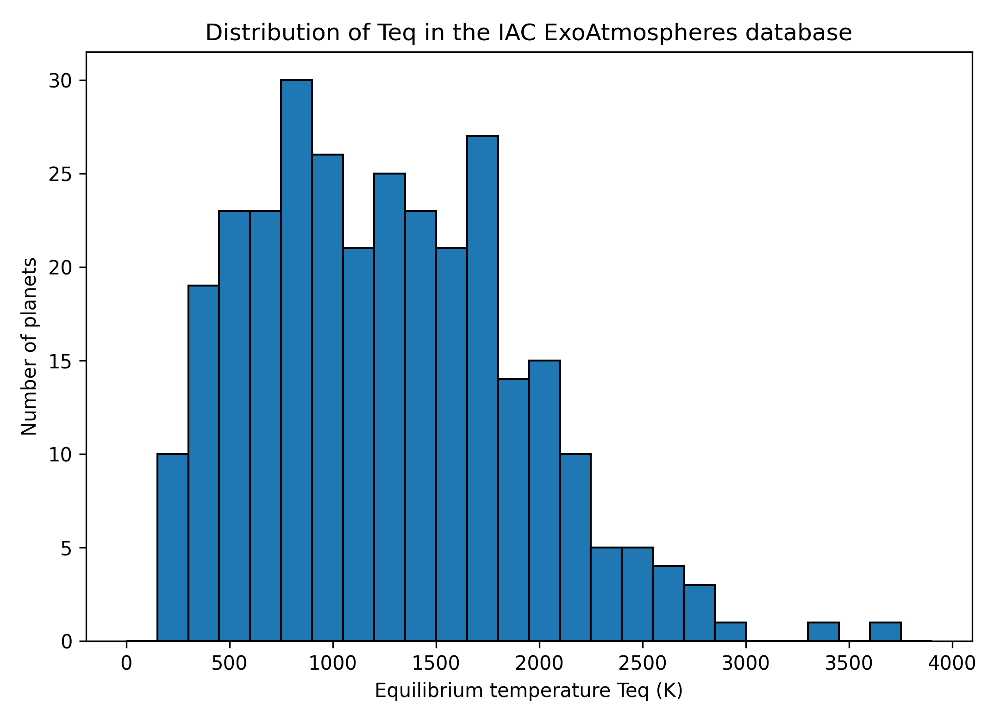
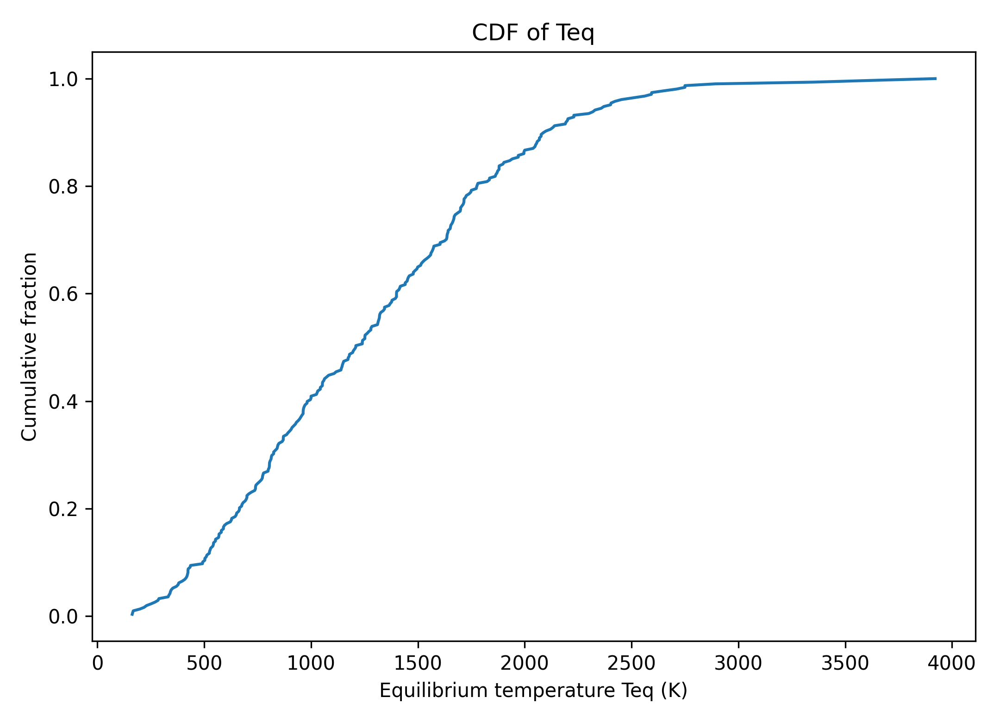
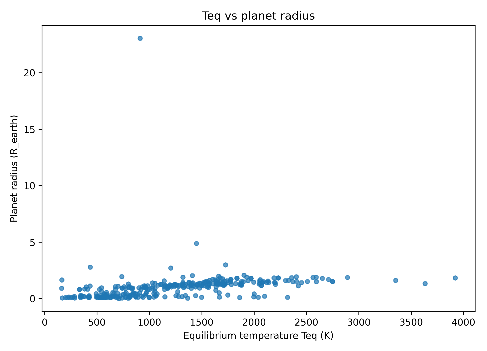

# 行星化学第七次作业
> Coursework artifact · Nanjing University · 2026  
> Original course module: Planetary Chemistry · HW7 · exoplanet atmosphere equilibrium-temperature statistics
>
> **Data provenance.** The exoplanet-atmosphere table used for this coursework analysis was downloaded from the IAC ExoAtmospheres database in June 2026. The original database snapshot is retained in the private course archive and is not redistributed here.

**姓名：杜鑫宇（Xinyu Du）**  
**日期：2026年6月9日**

---

## 第一题：系外行星大气数据库中平衡温度 $T_{eq}$ 的统计及其行星学意义

### 1. 数据来源与预处理

本题使用 IAC ExoAtmospheres 数据库（2026 年 6 月访问下载）的数据。该数据库收录的是已经开展过大气观测或被纳入大气表征研究的系外行星目标，因此它并不是"所有已知系外行星"的无偏样本，而是一个受观测选择效应显著影响的目标样本。

原始 csv 共包含 **1178 条记录**。由于同一颗行星可能对应多篇文献、多个观测波段或多种观测方式，这些记录并不是"一行一颗行星"的格式。例如 51 Peg b、51 Eri b 等行星在数据库中都出现了多次。为了得到真正的行星温度分布，首先按**行星名去重**，保留每颗行星的一组基本参数。去重后共有 **320 颗独立行星**，其中 **308 颗具有非空的平衡温度 $T_{eq}$**，它们构成下文统计的样本。

数据库中的平衡温度字段为 `temp_calculated`。平衡温度通常表示在给定反照率和热再分配假设下，行星与恒星辐射达到平衡时的特征温度，可写为：

$$
T_{eq} = T_\star \left(\frac{R_\star}{2a}\right)^{1/2} (1-A_B)^{1/4}
$$

其中 $T_\star$ 为恒星有效温度，$R_\star$ 为恒星半径，$a$ 为轨道半长轴，$A_B$ 为 Bond albedo。它不是行星表面真实温度，也不一定等于可观测大气层的温度，但可以作为衡量行星所受恒星辐照强弱的一阶指标。

### 2. $T_{eq}$ 的统计结果

对 308 颗行星的平衡温度进行统计后，得到以下基本结果：

| 参数 | 数值 |
|---|---:|
| 样本数 $N$ | **308** |
| 最低 $T_{eq}$ | **163 K** |
| 最高 $T_{eq}$ | **3921 K** |
| 平均值 | **1267 K** |
| 中位数 | **1210 K** |
| 第一四分位数 $Q_1$ | **765 K** |
| 第三四分位数 $Q_3$ | **1689 K** |

图 1 给出了平衡温度的直方图，图 2 给出了累计分布函数，图 3 则展示了 $T_{eq}$ 与行星半径的关系。

**图 1** IAC ExoAtmospheres 数据库中独立行星样本的平衡温度直方图。统计前先按行星名去重，再去除缺失的温度值。

**图 2** 平衡温度的累计分布函数。该图可直观看出样本在不同温度阈值以下的累计比例。

**图 3** 平衡温度与行星半径的关系。样本明显集中在高温且半径较大的气态行星区域。

为了更清楚地描述分布形态，将 $T_{eq}$ 按温度区间分箱统计如下：

| $T_{eq}$ 区间 (K) | 行星数 | 占比 |
|---|---:|---:|
| 0–500 | 31 | **10.1%** |
| 500–1000 | 93 | **30.2%** |
| 1000–1500 | 76 | **24.7%** |
| 1500–2000 | 66 | **21.4%** |
| 2000–2500 | 30 | **9.7%** |
| 2500–4000 | 12 | **3.9%** |

可以看到，这个数据库中的大气行星样本整体偏热：中位数约为 1210 K，四分位范围约为 765–1689 K。样本最多的区间是 500–1000 K，其次是 1000–1500 K 和 1500–2000 K。如果把 500–2000 K 的所有样本合并计算，共有 235 颗，占全部样本的 76.3%。相比之下，500 K 以下的低温行星只有 31 颗，占 10.1%，而 2000 K 以上的超高温行星共有 42 颗，占 13.6%。

### 3. 分布特征及其行星学含义

#### 3.1 样本主峰位于中高温区，而不是低温区

从图 1 和上表可以看出，ExoAtmospheres 数据库中的大气行星样本主要集中在 500–2000 K 的温度区间。这一范围对应的主要是热木星、温热木星、热海王星以及部分超热木星，而不是接近类地宜居温度的低温行星。这个数据库中被大气观测覆盖得最充分的，并不是整个系外行星总体，而是受强恒星辐照的近轨道气态行星。

#### 3.2 低温端的缺失首先反映的是观测选择效应

如果把这份数据库误当成"宇宙中行星温度分布"的直接代表，就会得出"低温行星很少"的错误印象。但数据库本身收录的是已经开展过大气研究或适合做大气观测的目标，因此它的温度分布更像是"当前大气观测样本的选择函数"，而不是银河系行星总体的无偏抽样。

低温行星之所以在数据库中明显偏少，主要有三个原因。第一，低温通常意味着轨道更远，凌星几率更低、公转周期更长，观测成本显著提高；第二，低温行星的大气尺度高度更小，透射光谱和发射光谱的信号都更弱；第三，许多低温行星本身还是小半径行星，这又进一步压低了信号强度。因此，当前数据库中的低温行星稀少，并不意味着宇宙中低温行星罕见，而是说明它们更难被做大气表征。

#### 3.3 高温长尾说明超热木星是当前大气研究的重要对象

图 1 的高温端并没有在 2000 K 附近突然截断，而是继续向 3000 K 以上延伸，最高达到 3921 K。这对应的是一批超热木星（ultra-hot Jupiters）或极端受辐照的气态行星。它们之所以在数据库中占有一席之地，是因为这类目标在大气研究中非常突出：高温意味着更大的大气尺度高度、更强的热发射、更显著的日夜温差和更丰富的高温化学过程，因此非常适合用透射光谱、二次食、相位曲线和高分辨率分子探测来研究。

#### 3.4 这一分布揭示的是"可观测大气行星"的温度分布

综合来看，这个 $T_{eq}$ 分布最重要的意义不在于"宇宙中的行星普遍有多热"，而在于揭示当前哪些行星最容易被纳入大气研究样本。对透射光谱和发射光谱来说，最有利的目标通常同时满足以下条件：

1. 轨道靠近恒星：凌星几率高，周期短，重复观测方便；
2. 温度较高：大气尺度高度大，谱信号强；
3. 行星半径较大：凌星信号和大气有效面积都更大；
4. 母星较亮：有利于提高信噪比。

因此，ExoAtmospheres 数据库中 $T_{eq}$ 的主峰偏向中高温区，本质上反映的是大气可观测性对样本选择的控制。这也是为什么热木星及其相关类型在图 3 中明显占据主导位置：它们既容易被发现，也容易被做大气表征。

综合来看，308 颗具有 $T_{eq}$ 数据的独立行星样本呈现出中高温集中、低温稀少、高温长尾的分布特征。中位数约 1210 K，500–2000 K 的样本占比达 76.3%，500 K 以下仅占 10.1%。这一分布不代表银河系行星的真实温度分布，而是反映了当前大气研究样本的选择效应：近恒星、高温、大半径、短周期的行星更容易产生强大气信号，因此在数据库中占据主导地位。

---

## 第二题：陨石撞击能否将地球微生物传播到水星、金星和月球？

### 1. 问题拆解

地球微生物通过陨石撞击传播到其他天体需满足四个约束条件：

1. 撞击抛射达到逃逸速度，岩石脱离地球
2. 微生物在抛射冲击中存活，不被高温高压完全灭活
3. 喷出物进入与目标天体相交的轨道并最终撞上
4. 微生物在行星际飞行、再入和着陆过程中仍保持活性

该问题受撞击动力学、轨道转移和生物存活条件共同约束。

### 2. 地球喷出物能否离开地球

地球逃逸速度约 11.2 km/s。大型撞击可将近地表岩石加速至逃逸以上，使其进入日心轨道。火星陨石从火星到达地球已证明"撞击抛射—行星际转移"在太阳系内可行。

并非所有喷出物都经历相同的高温高压过程。在撞击坑近地表剥离（spallation）过程中，部分岩石可在较低冲击压力下被高速抛出。微生物若位于岩石内部的孔隙、裂隙或矿物间隙中，岩石可提供一定的热屏蔽和辐射屏蔽，因此"完全无法存活离开地球"并不成立。

### 3. 对三个目标天体的分别评估

#### (1) 月球：最容易到达，也最可能实现传播

月球位于地月系统内部，喷出物无需经历长期日心轨道演化即可被月球截获，轨道条件最宽松，也不需深度进入太阳引力井。从动力学角度看，月球是三者中最容易实现的目标。

但月球表面缺乏稠密大气和液态水，昼夜温差大、辐射强。即使微生物被带到月球，也几乎无法在月表长期繁殖或建立生态位。"传播到达"最容易，"长期定殖"则几乎不可能。

#### (2) 金星：传播在动力学上可能，但长期存活前景极差

金星位于地球轨道内侧，喷出物需进入更靠近太阳的日心轨道才能与之相交，难度高于月球。但只要速度方向和轨道参数合适，仍有可能与金星轨道相交。

金星大气对微生物传播有双重作用：厚大气可减小小型喷出物的最终撞击速度，但再入过程伴随强烈空气加热，显著增加灭活概率。金星表面温度约 460°C、压强约 90 bar、大气具强腐蚀性。即使喷出物成功到达，微生物也无法在表面存活。

金星在动力学上可能达到，但概率低于月球；再入加热和极端表面环境进一步压低存活概率。

#### (3) 水星：三者中最不利的目标

水星位于更深的太阳引力井中。喷出物需显著降低日心轨道近日点，并在合适时机与水星轨道相交，对速度和方向要求最高。从地球到水星的自然撞击转移概率低于金星，更远低于月球。

靠近太阳意味着更强的辐照和粒子环境。即使微生物被岩石部分屏蔽，飞行过程中也承受更强的热与辐射负荷。水星缺乏稠密大气减速，最终为高速硬碰撞，进一步降低存活概率。

无论到达概率还是生物存活概率，水星均为三者中最不利的目标。

### 4. 三者的综合比较

| 目标天体 | 轨道到达难度 | 飞行与辐射环境 | 再入/着陆条件 | 长期生存前景 | 综合判断 |
|---|---:|---:|---:|---:|---|
| **月球** | 低 | 中等 | 无大气，高速撞击 | 极低 | **最容易传播到达** |
| **金星** | 中等 | 中等偏低 | 稠密大气再入强加热，表面极端高温高压 | 极低 | **可传播但难存活** |
| **水星** | 高 | 低 | 无大气，近太阳热环境恶劣 | 极低 | **最不可能** |

综合评估：月球最容易到达，金星在动力学上可行，水星最困难。三颗天体排序为：

$$
\text{月球} > \text{金星} > \text{水星}
$$

但若进一步要求微生物保持活性并长期生存，三颗天体均不乐观。
