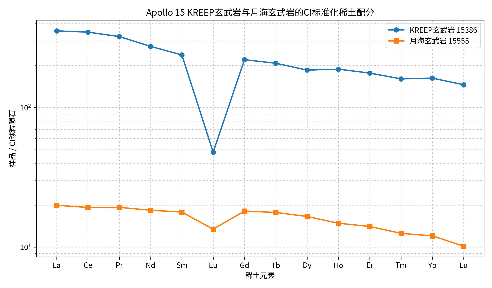
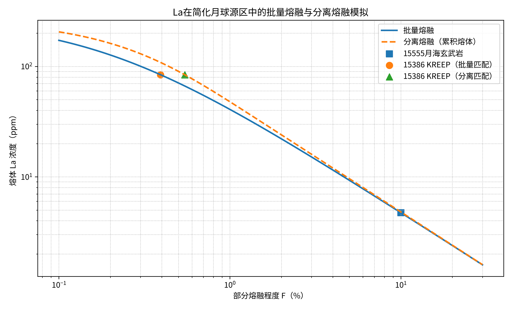

# 行星化学第八次作业
> Coursework artifact · Nanjing University · 2026  
> Original course module: Planetary Chemistry · HW8 · Lunar KREEP / REE partitioning / lunar magma ocean

**姓名：杜鑫宇（Xinyu Du）**  
**日期：2026 年 6 月 17 日**

---

## 第一题：KREEP 与月海玄武岩的稀土元素分配模拟

### 1. 原始数据与样品选择

为了尽量减小不同着陆区和分析方法带来的差异，选取了同属 Apollo 15 样品的两块岩石进行比较：

- **15386**：较为典型的原生 KREEP 玄武岩，采用 Neal 与 Kramer（2003）的 ICP-MS 数据；
- **15555**：橄榄石标准月海玄武岩，采用 Neal（2001）的 ICP-MS 数据。

两组数据均由 Lunar Sample Compendium 汇总。原始稀土元素浓度如下，单位为 ppm：

| 元素 | KREEP 玄武岩 15386 | 月海玄武岩 15555 | 15386/15555 |
| :---: | ---: | ---: | ---: |
| La | 84.10 | 4.73 | 17.78 |
| Ce | 213.10 | 11.80 | 18.06 |
| Pr | 30.00 | 1.79 | 16.76 |
| Nd | 125.60 | 8.40 | 14.95 |
| Sm | 36.50 | 2.73 | 13.37 |
| Eu | 2.78 | 0.78 | 3.56 |
| Gd | 43.90 | 3.61 | 12.16 |
| Tb | 7.51 | 0.64 | 11.73 |
| Dy | 45.70 | 4.08 | 11.20 |
| Ho | 10.30 | 0.81 | 12.72 |
| Er | 28.30 | 2.25 | 12.58 |
| Tm | 3.97 | 0.31 | 12.81 |
| Yb | 26.20 | 1.94 | 13.51 |
| Lu | 3.59 | 0.25 | 14.36 |

从原始浓度就可以看出，15386 的大部分稀土元素含量约为 15555 的 11–18 倍。其中 La 为 84.1 ppm，而月海玄武岩 15555 仅为 4.73 ppm；Eu 的差异只有 3.56 倍，明显小于其他稀土元素，说明 KREEP 样品具有很强的负 Eu 异常。

采用 Sun 与 McDonough（1989）的 CI 球粒陨石值进行标准化，结果见图 1。

**图 1** 显示，月海玄武岩 15555 的稀土配分总体较平坦，大致为 10–20 倍 CI；KREEP 玄武岩 15386 则达到约 150–350 倍 CI，并从轻稀土向重稀土逐渐降低。两者最显著的区别是 15386 的 Eu 负异常。按

$$
\frac{\mathrm{Eu}}{\mathrm{Eu}^{*}}
=
\frac{\mathrm{Eu}_{N}}{\sqrt{\mathrm{Sm}_{N}\mathrm{Gd}_{N}}}
$$

计算，15386 的 $\mathrm{Eu/Eu^*}=0.21$，而 15555 为 0.75。斜长石中的 Eu 主要以 $\mathrm{Eu^{2+}}$ 进入 Ca 位点，因此斜长石比其他硅酸盐矿物更容易容纳 Eu。KREEP 的强负 Eu 异常说明，在富集稀土的残余熔体形成之前，已经有大量斜长石从体系中分离。

### 2. La 的矿物–熔体分配系数

为了用一个稀土元素比较两种熔融模型，我选择轻稀土元素 La。La 在橄榄石、低钙辉石和斜长石中都高度不相容，而且 15386 与 15555 的 La 浓度差异明显。

Haupt et al.（2024）在月球岩浆洋相关温度和氧逸度条件下测得的代表性分配系数为：

| 矿物 | $D_{\mathrm{La}}^{\mathrm{mineral/melt}}$ | 采用值 |
| :--- | :---: | :--- |
| 橄榄石 | 约 0.0002–0.0006 | **0.0006** |
| 斜方辉石 | 约 0.0012 | **0.0012** |
| 斜长石 | 约 0.019–0.026 | **0.019** |

为了把三个矿物的分配系数合成为全岩分配系数，假设一个简化的月球源区由 50% 橄榄石、45% 斜方辉石和 5% 残留或捕获斜长石组成，则：

$$
D_{\mathrm{bulk}}
=
0.50\times0.0006
+
0.45\times0.0012
+
0.05\times0.019
=
\mathbf{0.00179}
$$

这里的矿物比例只是为了进行一阶模型比较，不代表唯一的月海玄武岩源区组成。即使把斜长石比例在 0–10% 之间调整，$D_{\mathrm{bulk}}$ 仍然远小于 1，因此 La 高度不相容这一结论不会改变。

### 3. 批量熔融与分离熔融模型

批量熔融假设熔体在达到最终熔融程度之前始终与残余固相保持平衡：

$$
\frac{C_L}{C_0}
=
\frac{1}{D+F(1-D)}
$$

其中 $C_0$ 是源区浓度，$C_L$ 是最终熔体浓度，$D$ 是全岩分配系数，$F$ 是熔融比例。

分离熔融中，每一小份熔体形成后立即离开残余固相。若把所有瞬时熔体最终汇集，累积熔体的平均浓度为：

$$
\frac{\overline{C_L}}{C_0}
=
\frac{1-(1-F)^{1/D}}{F}
$$

为了把模型转换成实际浓度，我以 15555 的 La = 4.73 ppm 为基准，假设它对应 10% 批量熔融，反推出源区 La 浓度：

$$
C_0
=
4.73\times[D+0.10(1-D)]
=
\mathbf{0.481\ ppm}
$$

这一数值与贫稀土的月球原始或累积地幔源区处于同一数量级。不同熔融程度下的计算结果如下：

| 熔融程度 $F$ | 批量熔融 La（ppm） | 分离熔融累积熔体 La（ppm） |
| :---: | ---: | ---: |
| 0.1% | 172.38 | 205.79 |
| 0.2% | 126.93 | 161.78 |
| 0.5% | 70.88 | 90.28 |
| 1.0% | 40.83 | 47.89 |
| 2.0% | 22.09 | 24.03 |
| 5.0% | 9.30 | 9.61 |
| 10.0% | 4.73 | 4.81 |
| 20.0% | 2.39 | 2.40 |

**图 2** 表明，对于 $D\ll1$ 的 La，两种模型都表现出熔融程度越低、熔体越富集的趋势。当 $F$ 大于几个百分点时，La 几乎全部被抽取到熔体中，两种模型逐渐接近 $C_L/C_0\approx1/F$；在极低熔融程度下，分离熔融的累积熔体比批量熔融略富集。

以同一个源区为前提，要达到 15386 的 La = 84.1 ppm：

$$
F_{\mathrm{batch}} \approx \mathbf{0.39\%}
$$

$$
F_{\mathrm{fractional}} \approx \mathbf{0.54\%}
$$

也就是说，单从 La 浓度出发，KREEP 可以被形式化地解释为不足 1% 的极低程度部分熔融产物，而普通 Apollo 15 月海玄武岩则对应约 10% 的熔融。

### 4. 对 KREEP 形成机制的讨论

这个计算说明了一个重要问题：低程度部分熔融确实能够把高度不相容的 La 浓缩到 KREEP 的数量级，但它不能完整解释 KREEP 的成因。

首先，KREEP 不只是 La 高，而是 K、REE、P、Th、U、Zr、Hf 等一整套不相容元素同时富集。如果只把普通月幔源区的熔融程度从 10% 降到约 0.5%，虽然能够提高 La，却要求极小的熔体体积分数，并且难以稳定地产生具有相对一致不相容元素比例的 KREEP 组分。

其次，15386 的 $\mathrm{Eu/Eu^*}$ 只有约 0.21。普通深部月幔源区主要由橄榄石和辉石组成，一般不含足以控制 Eu 的残余斜长石，因此简单的深部低程度熔融很难产生如此强的负 Eu 异常。相反，在月球岩浆洋结晶过程中，密度较小的斜长石上浮形成月壳，并优先带走 Eu；La 和其他不相容元素则持续留在残余液体中。

最后，橄榄石和辉石的 $D_{\mathrm{La}}$ 极低，意味着岩浆洋早期结晶时几乎不消耗 La。随着结晶程度不断增加，残余液体体积越来越小，La、K、P、Th 和 U 等元素会同步浓缩。当月球岩浆洋达到约 99% 或更高的结晶程度后，最后的富集残余液体即 **urKREEP**。后期的撞击、岩浆侵位、同化混染或对 urKREEP 层的再熔融，可以形成实际采集到的 KREEP 玄武岩和富 KREEP 冲击熔岩。

因此，我认为更合理的形成模式是：KREEP 的根本来源是月球岩浆洋高度结晶后的末期残余熔体，而不是普通月幔仅靠一次极低程度部分熔融直接形成。
批量熔融和分离熔融模型能够解释不相容元素为什么会在小体积熔体中富集，但 15386 的整体稀土配分、强负 Eu 异常和多种不相容元素的协同富集，仍然需要“岩浆洋分异—urKREEP 残余层—后期再熔融或混合”的过程。

---

## 第二题：大碰撞后的月球地幔——整月熔融还是半月熔融

图中左侧模型认为大碰撞后月球发生了深部乃至近乎整个月球尺度的熔融，随后形成金属核、橄榄石—辉石累积地幔、斜长石浮选月壳和末期 KREEP 层；右侧模型则认为只有上半个月球发生熔融，下部地幔从未熔融，并且没有形成独立地核。

### 1. 验证思路：直接探测深部结构

我认为最直接的判据是月震地震学，并辅以月球激光测距、重力场和全球矿物学观测。

两种假说对深部结构的预测不同：

| 可检验特征 | 整月或深部全球熔融模型 | 半月熔融模型 |
| :--- | :--- | :--- |
| 月球中心 | 金属向中心迁移，形成固态内核和液态外核 | 图示模型中无独立地核 |
| 下部地幔 | 经历熔融、结晶和累积层分异 | 保留未熔融的原始物质 |
| 约 400–500 km 深度 | 可出现累积层、部分熔融层或后期翻转界面 | 应出现熔融上层与原始下层之间的强烈成分界面 |
| 月壳 | 全球性斜长石浮选壳 | 可形成表层壳，但较难解释深部同步分异 |
| KREEP | 全球岩浆洋结晶末期残余液 | 仅来自浅部岩浆洋残余液 |

地震波通过不同密度和弹性性质的物质时会发生反射、折射和波型转换。液态金属外核不能传播 S 波，同时核幔边界会产生特定的 P、S 反射或转换震相。因此，在月球正面和背面布设多个宽频带地震台，记录深月震和陨石撞击产生的穿月震相，就可以反演地核半径、下地幔速度结构以及是否存在约 400–500 km 深度的原始未熔融层。

如果观测到稳定的固态内核、液态外核，并且深部地幔表现为分异后的累积层结构，那么左侧假说更合理；如果没有核震相，且在半径约 1300–1400 km 处存在全球连续、非常强的成分突变界面，则右侧假说会得到支持。

### 2. 现有证据

第一项证据是月球金属核。 Weber et al.（2011）重新处理 Apollo 月震记录后，识别出来自月球深部界面的反射和转换震相，提出月球具有半径约 240 km 的固态内核、半径约 330 km 的液态外核，其外侧还有半径约 480 km 的部分熔融边界层。地核的存在意味着金属曾经从硅酸盐中分离并向月球中心迁移，直接否定了图中“半月熔融且无核”的严格版本。

第二项证据是全球性的富斜长石月壳。 Ohtake et al.（2009）利用 SELENE 多波段成像数据，在月球全球范围识别出斜长石含量接近 100 vol.% 的纯斜长岩。斜长石密度低于共存岩浆，能够在大范围熔融体中上浮并形成浮选壳；全球分布的高纯度斜长岩比局部撞击熔池更容易由全球岩浆洋解释。

第三项证据来自 KREEP。 第一题中的 15386 比月海玄武岩富集约一个数量级以上的稀土元素，并具有强负 Eu 异常。这正是“早期斜长石分离—残余熔体逐渐富集不相容元素”的预期结果。KREEP 因而把表层斜长岩壳与深部岩浆洋结晶过程联系在了一起。

### 3. 结论与局限

综合地核、全球斜长岩壳和 KREEP 三类证据，我更支持图中左侧的深部、全球尺度熔融与分异模型。它能够同时解释：

1. 金属核的形成；
2. 橄榄石和辉石累积地幔；
3. 斜长石浮选形成的月球高地壳；
4. 岩浆洋结晶末期 urKREEP 的产生。

不过，“支持左侧模型”不应被理解为现有数据已经证明月球从表面到中心的每一处都达到 100% 完全熔融。Apollo 地震台全部位于正面，深部月球的分辨率仍然有限；一些现代模型允许深部保留少量未完全熔融或未充分混合的区域。现有证据能够较有力地排除图中右侧“下半月完全原始且没有地核”的简单模型，但还不能精确确定最初岩浆洋到底深达 400 km、1000 km，还是接近整个月幔。

下一步最有效的验证方式，是在月球背面和南极—艾特肯盆地布设长期地震台，并采回可能来自深部地幔的物质。这样才能真正区分“全球但有限深度的岩浆洋”和“近乎整个月幔熔融”这两个更细致的模型。

---

## 参考文献

- Haupt, C.P., Renggli, C.J., Rohrbach, A., Berndt, J., Schwinger, S., Maurice, M., Schulze, M., Breuer, D. & Klemme, S. (2024). Trace element partitioning in the lunar magma ocean: an experimental study. *Contributions to Mineralogy and Petrology*, 179, 45. DOI: [10.1007/s00410-024-02118-z](https://doi.org/10.1007/s00410-024-02118-z)
- Meyer, C. (2010). *Lunar Sample Compendium: 15555, Olivine-normative Basalt*. Lunar and Planetary Institute.
- Meyer, C. (2011). *Lunar Sample Compendium: 15386, KREEP Basalt*. Lunar and Planetary Institute.
- Neal, C.R. (2001). Interior of the Moon: The presence of garnet in the primitive deep lunar mantle. *Journal of Geophysical Research: Planets*, 106(E11), 27865–27885. DOI: [10.1029/2000JE001386](https://doi.org/10.1029/2000JE001386)
- Neal, C.R. & Kramer, G.Y. (2003). The composition of KREEP: A detailed study of KREEP basalt 15386. *34th Lunar and Planetary Science Conference*, Abstract 2023.
- Ohtake, M., Matsunaga, T., Haruyama, J., et al. (2009). The global distribution of pure anorthosite on the Moon. *Nature*, 461, 236–240. DOI: [10.1038/nature08317](https://doi.org/10.1038/nature08317)
- Sun, S.-s. & McDonough, W.F. (1989). Chemical and isotopic systematics of oceanic basalts: implications for mantle composition and processes. *Geological Society, London, Special Publications*, 42, 313–345. DOI: [10.1144/GSL.SP.1989.042.01.19](https://doi.org/10.1144/GSL.SP.1989.042.01.19)
- Warren, P.H. & Wasson, J.T. (1979). The origin of KREEP. *Reviews of Geophysics and Space Physics*, 17(1), 73–88. DOI: [10.1029/RG017i001p00073](https://doi.org/10.1029/RG017i001p00073)
- Weber, R.C., Lin, P.-Y., Garnero, E.J., Williams, Q. & Lognonné, P. (2011). Seismic detection of the lunar core. *Science*, 331(6015), 309–312. DOI: [10.1126/science.1199375](https://doi.org/10.1126/science.1199375)
