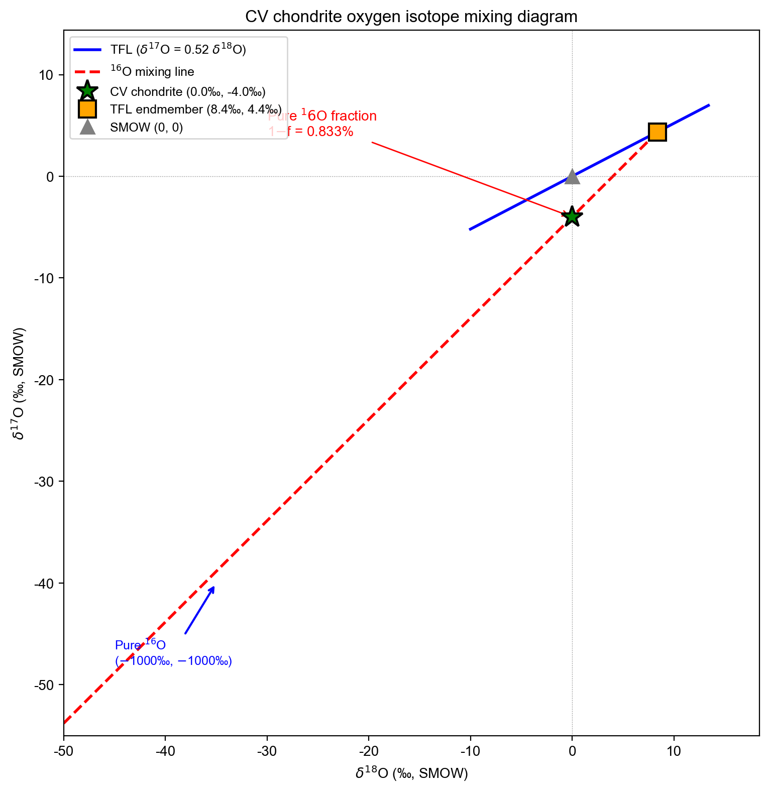
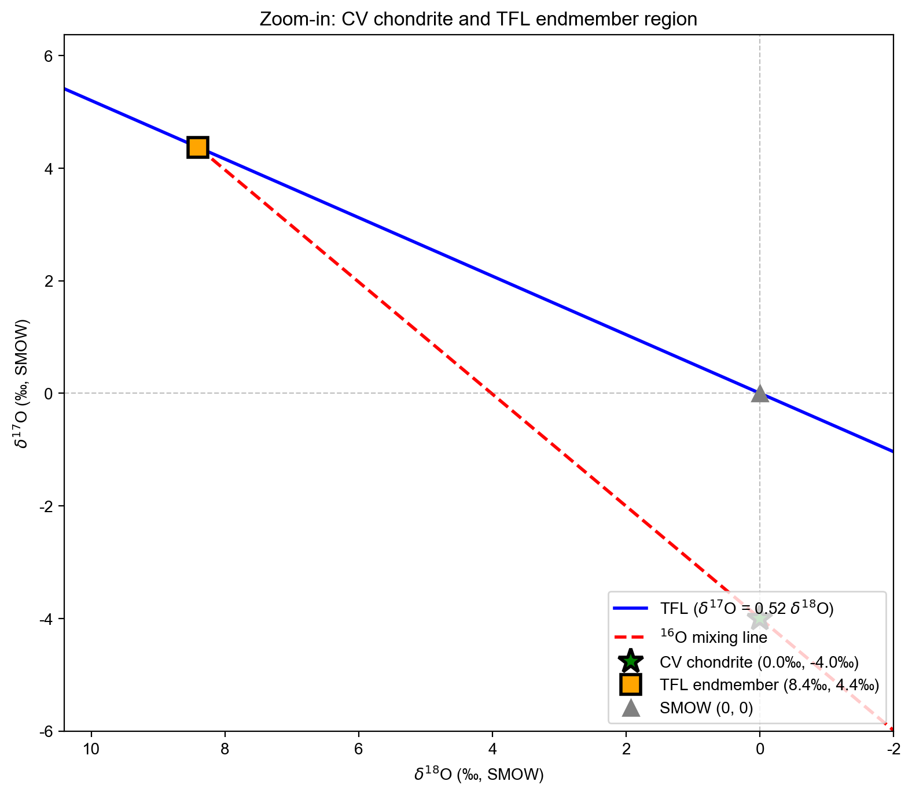
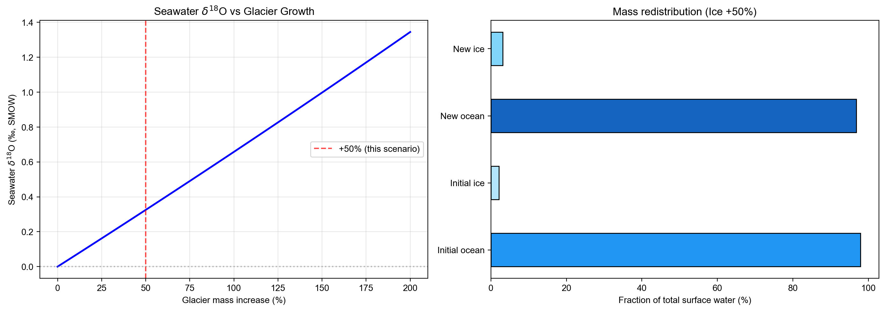
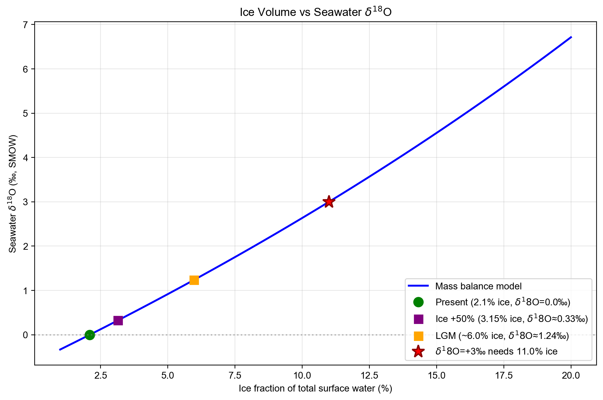
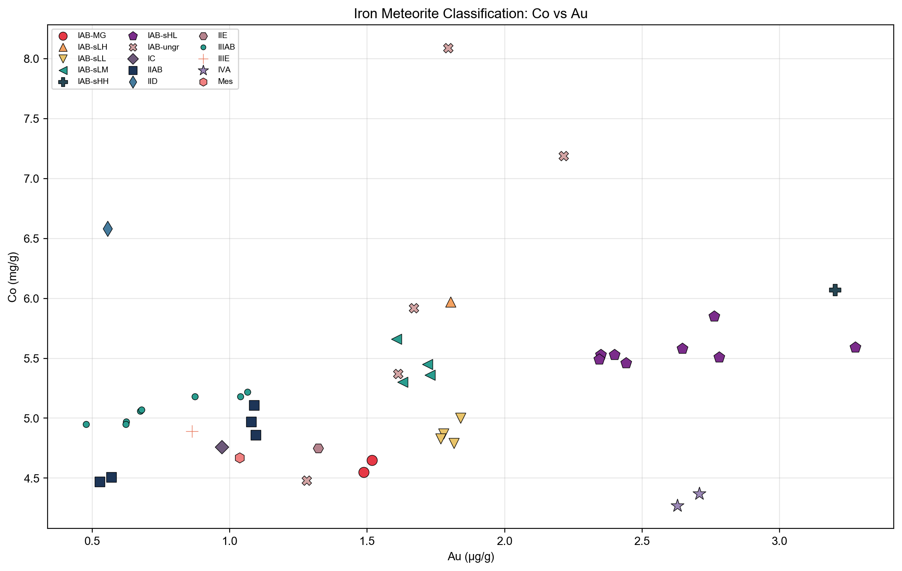
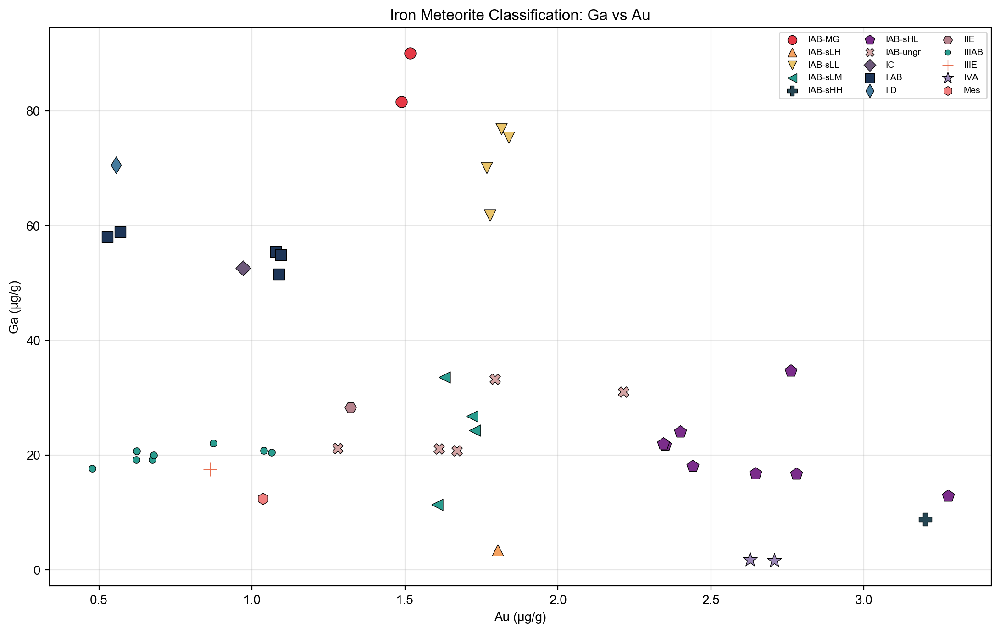
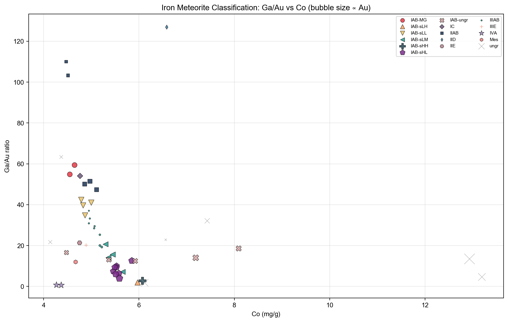

# 行星化学第五次作业
> Coursework artifact · Nanjing University · 2026  
> Original course module: Planetary Chemistry · HW5 · meteorite geochemistry

**姓名：杜鑫宇（Xinyu Du）**  
**日期：2026 年 4 月 30 日**

---

## 第一题：CV 球粒陨石氧同位素混合计算

δ 值转化为同位素比值 $R$（相对于 SMOW 归一化）的关系为 $R = \delta/1000 + 1$。在 $R$ 空间中进行二元混合，纯 $^{16}\text{O}$ 端元的 $R_{18}$ 和 $R_{17}$ 均为 0，因此混合方程为：

$$R_{18}^{\text{CV}} = f \cdot R_{18}^{\text{TFL}}, \quad R_{17}^{\text{CV}} = f \cdot R_{17}^{\text{TFL}}$$

两式相除可知混合线上 $R_{17}/R_{18}$ 比值恒定为 $R_{17}^{\text{CV}}/R_{18}^{\text{CV}} = 0.996$。再联立 TFL 约束 $R_{17}^{\text{TFL}} = \lambda R_{18}^{\text{TFL}} + (1-\lambda)$（$\lambda = 0.52$），即可解出 TFL 端元的位置。

计算结果汇总如下：

| 物理量                         | 数值       |
| :----------------------------- | :--------- |
| TFL 端元 $\delta^{18}\text{O}$ | **+8.40‰** |
| TFL 端元 $\delta^{17}\text{O}$ | **+4.37‰** |
| TFL 端元占比 $f$               | 99.167%    |
| 纯 $^{16}\text{O}$ 占比 $1-f$  | **0.833%** |

**图 1** 是三氧同位素混合图。蓝色实线是 TFL，红色虚线是 $^{16}\text{O}$ 混合线。CV 球粒陨石（绿色星形，0‰, −4‰）落在 TFL 下方，与 TFL 端元（橙色方形，+8.40‰, +4.37‰）的连线即为混合线。纯 $^{16}\text{O}$ 端元远在 (−1000‰, −1000‰)，用左下角蓝色箭头标出方向。红色标注给出了纯 $^{16}\text{O}$ 的质量分数约为 0.833%。

**图 2** 把 CV 球粒陨石附近的区域放大了。可以清楚看到 CV 点与 TFL 端元之间的位置关系，混合线与 TFL 的交角很大——混合线斜率约 0.996，而 TFL 斜率只有 0.52，两条线的差异非常明显。

计算得到的纯 $^{16}\text{O}$ 占比仅约 0.83 wt%，虽然量很小，但这与碳质球粒陨石中 CAIs（富钙铝包体）的 $^{16}\text{O}$ 过剩现象是吻合的。这个结果支持了早期太阳系中存在一个富 $^{16}\text{O}$ 储库的假说，陨石中的氧同位素异常可以用 $^{16}\text{O}$-rich 端元与类地球组分之间的二元混合来解释。

---

## 第二题：冰川–海洋氧同位素质量平衡

### (1) 冰川增加 50% 的影响

设总水量守恒，先算出当前全球表层水体的平均同位素组成：

$$\delta_{\text{total}} = 2.1\% \times (-30\text{‰}) + 97.9\% \times 0\text{‰} = -0.63\text{‰}$$

冰川增加 50% 后，冰占比从 2.10% 升至 3.15%，海洋占比降至 96.85%。设冰川的 $\delta^{18}\text{O}$ 保持不变（−30‰），新的海水 $\delta^{18}\text{O}$ 由下式解出：

$$3.15\% \times (-30\text{‰}) + 96.85\% \times \delta_{\text{oc}}' = -0.63\text{‰}$$

解得 $\delta_{\text{oc}}' \approx +0.33\text{‰}$，即海水 $\delta^{18}\text{O}$ 升高了约 0.33‰。

| 情景      | 冰川占比 | 海洋占比 | 海水 $\delta^{18}\text{O}$ |
| :-------- | :------- | :------- | :------------------------- |
| 当前      | 2.10%    | 97.90%   | 0‰                         |
| 冰川 +50% | 3.15%    | 96.85%   | **+0.33‰**                 |

**图 3** 左图展示了冰川增长幅度（0–200%）与海水 $\delta^{18}\text{O}$ 的关系曲线，红色虚线标注了本题 +50% 的位置。从曲线可以看出两者近似线性关系——因为冰占比本身很小，分母变化不大。右图是对比了冰量变化前后的质量再分配。

### (2) 海水 δ¹⁸O = +3‰ 是否可行？

计算如果要让海水 $\delta^{18}\text{O}$ 升到 +3‰，需要多大的冰量：

$$f_{\text{ice}} = \frac{3 - (-0.63)}{3 - (-30)} = \frac{3.63}{33} = 11.0\%$$

这意味着冰川需要占到表层水体的 11%，是当前冰量（2.1%）的约 **5.2 倍**。如果按当前冰川全部融化对应约 65 m 海平面上升来估算，额外需要锁住的冰量对应的海平面下降约为 **275 m**。

**图 4** 画出了冰占比与海水 $\delta^{18}\text{O}$ 的完整关系。我在图上标了四个点：现代（2.1% 冰，0‰）、冰川 +50% 情景（3.15%，+0.33‰）、末次盛冰期 LGM（约 6%，约 +1.0‰），以及 +3‰ 目标（需要 11% 冰）。可以看到要达到 +3‰，曲线需要延伸到非常靠右的位置。

结合文献，我整理了不同时期海水 $\delta^{18}\text{O}$ 与冰量的对比：

| 时期              | 海水 $\delta^{18}\text{O}$ | 海平面变化 | 说明                                             |
| :---------------- | :------------------------- | :--------- | :----------------------------------------------- |
| 现代（间冰期）    | 0‰                         | 基准       | 冰量约 2.1%                                      |
| 冰川 +50%（本题） | ~+0.33‰                    | ~−33 m     | 相当于冰量中度增长                               |
| LGM（~21 ka）     | ~+1.0‰                     | ~−120 m    | 劳伦太德 + 芬诺斯堪的亚冰盖（Lear et al., 2000） |
| +3‰ 目标          | +3.0‰                      | ~−275 m    | 需当前冰量的 ~5.2 倍                             |

通过质量平衡计算我发现，想让海水 $\delta^{18}\text{O}$ 升到 +3‰ 需要的冰量实在太大了。LGM 时期海平面下降约 120 m 就已经是地球最近几亿年来冰量的极限了（Zachos et al., 2001），而 +3‰ 对应的 275 m 海平面下降远远超出任何已知的冰期记录。即使把时间推到雪球地球事件（~720–635 Ma），冰量是否能达到这个规模也存在争议。

据我查到的文献（Knauth & Lowe, 2003; Jaffrés et al., 2007），如果地质记录中确实存在海水 $\delta^{18}\text{O}$ 高达 +3‰ 的信号，不太可能单纯由冰量效应造成。更合理的解释是叠加了其他长期过程，比如洋中脊热液蚀变改变了大洋地壳与水之间的氧同位素交换通量，或者大陆风化速率发生了系统性变化。这个问题的争论在学界已经持续了很多年，目前还没有统一的结论。

---

## 第三题：铁陨石化学群分类 — Co-Au 与 Ga-Au 分布图

从附件中提取了 50 个铁陨石样品的 Co（mg/g）、Ga（μg/g）、Au（μg/g）含量。这些样品涵盖了 IAB 各亚群（MG、sLH、sLL、sLM、sHH、sHL）、IC、IIAB、IID、IIE、IIIAB、IIIE、IVA 以及若干未分组陨石。我把它们投到 Co-Au 和 Ga-Au 两张图上，看看这些元素组合能不能把不同的化学群分开。

从 **图 5**（Co-Au 图）可以直观地看到各个群的初步分布（图中排除了 7 个未分组极端样品以免坐标轴被过度拉伸）。IIAB（深蓝色方块）和 IIIAB（青色小圆点）主要集中在图的左侧低 Au 区域（< 1.2 μg/g），这两类在 Co-Au 空间里重叠得比较多，光靠这组元素不太容易将它们区分开。相比之下，IVA（紫色星形）非常有辨识度——Au 很高（2.6–2.8 μg/g）但 Co 却偏低（约 4.3 mg/g），完全独立在图的右下方。IAB 族的各个亚群分布比较分散，其中 IAB-sHH（深色十字）有着全场最高的 Au（> 3.0 μg/g），而 IAB 主群（MG，红色圆点）则落在坐标图偏左下的位置。

**图 6**（Ga-Au 图，同样排除了未分组极端样品）的分类效果让我印象深刻——它把刚才在 Co-Au 图里混在一起的某些群给彻底分开了。最明显的对比是 IIAB 和 IIIAB：IIAB（深蓝色方块）的 Ga 含量很高（50–60 μg/g），而 IIIAB（青色小圆点）的 Ga 只有 20 μg/g 左右，两者在纵轴上被清晰地拉开，不再重叠。IVA（紫色星形）依然特征鲜明，以极其亏损的 Ga（不足 2 μg/g）和高 Au 独立于右下角。另外，IAB-MG 主群（红色大圆点）因为有着极高的 Ga 含量（80–90 μg/g），在图的最上方形成了一个孤立的高 Ga 区域。

对比这两张图，我发现 Ga 在化学群分类上的"威力"似乎比 Co 更强。这可能是因为 Ga 作为中等挥发性元素，对母体形成时的挥发/冷凝过程极其敏感；而 Co 和 Au 都是亲铁元素，主要受控于核幔分异过程。所以核幔分异条件相似的 IIAB 和 IIIAB 在 Co-Au 图上才会重叠，却在代表挥发性的 Ga 轴上被清晰地拉开距离。

总的来说，Co-Au 和 Ga-Au 这两组元素对可以作为传统 Ge-Ni、Ir-Ni 分类图的极佳补充。特别是 Ga 和 Au 的联合使用，能够将反映母体热历史的挥发性差异与反映分异程度的亲铁性差异结合起来，有效分离像 IVA 和 IIAB 这样具有极端特征的化学群。

**图 7** 把三个元素的信息整合到一张图里：横轴是 Co，纵轴是 Ga/Au 比值，气泡大小对应 Au 含量。这张图立刻凸显了几个极端情况：IIAB（深蓝色方块，气泡小）因为低 Au 且高 Ga，占据了图的左上方——它的 Ga/Au 比值最高突破 100；而 IVA（紫色星形，气泡大）由于极低的 Ga 和高 Au，Ga/Au 比值被压在贴近横轴的右下角（趋近于 0）。右侧散落的几个灰色大叉号（ungr）揭示了一些未分组陨石具有异常高的 Co 含量（> 12 mg/g）。三元素联用确实比两张单独的二元图提供了更完整的分类视角。

---

## 参考文献

- Knauth, L.P. & Lowe, D.R. (2003). High Archean climatic temperature inferred from oxygen isotope geochemistry of cherts in the 3.5 Ga Swaziland Supergroup, South Africa. *GSA Bulletin*, 115(5), 566–580. DOI: [10.1130/0016-7606(2003)115<0566:HACTIF>2.0.CO;2](https://doi.org/10.1130/0016-7606(2003)115<0566:HACTIF>2.0.CO;2)
- Jaffrés, J.B.D., Shields, G.A. & Wallmann, K. (2007). The oxygen isotope evolution of seawater: A critical review of a long-standing controversy and an improved geological water cycle model for the past 3.4 billion years. *Earth-Science Reviews*, 83(1–2), 83–122. DOI: [10.1016/j.earscirev.2007.04.002](https://doi.org/10.1016/j.earscirev.2007.04.002)
- Lear, C.H., Elderfield, H. & Wilson, P.A. (2000). Cenozoic deep-sea temperatures and global ice volumes from Mg/Ca in benthic foraminiferal calcite. *Science*, 287(5451), 269–272. DOI: [10.1126/science.287.5451.269](https://doi.org/10.1126/science.287.5451.269)
- Zachos, J., Pagani, M., Sloan, L., Thomas, E. & Billups, K. (2001). Trends, rhythms, and aberrations in global climate 65 Ma to present. *Science*, 292(5517), 686–693. DOI: [10.1126/science.1059412](https://doi.org/10.1126/science.1059412)
