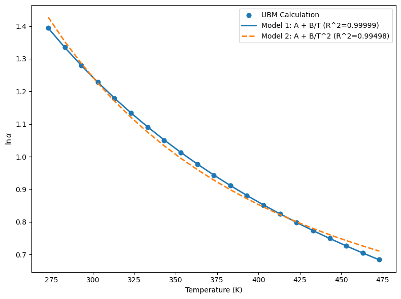

# Problem 4
> Coursework artifact · Nanjing University · 2026  
> Original course module: Planetary Chemistry · HW4 · thermodynamics and phase equilibria

杜鑫宇

## 第一部分：水与氢气之间的氢同位素交换
**交换方程：** $\text{H}_2\text{O} + \text{HD} \rightleftharpoons \text{HDO} + \text{H}_2$

### 1. 分子振动频率
查阅 NIST 数据库，上述四种分子的基本振动频率（单位：$\text{cm}^{-1}$）如下：
*   **H₂O:** 1595.0, 3657.0, 3756.0
*   **HDO:** 1402.0, 2727.0, 3707.0
*   **H₂:** 4161.0
*   **HD:** 3632.0

### 2. 约化配分函数比与分馏系数计算
采用 UBM 公式，基于分子的振动频率，分别计算 $\text{H}_2\text{O}$ 和 $\text{H}_2$ 的 D/H 约化配分函数比值（$f_{\text{H}_2\text{O}}$ 和 $f_{\text{H}_2}$）。分馏系数计算公式为 $\alpha = f_{\text{H}_2\text{O}} / f_{\text{H}_2}$。在 273 K – 473 K（间隔 10 K）范围内的计算结果如下：

| 温度 (K) | $\text{H}_2\text{O}$ 配分函数比 ($f_{\text{H}_2\text{O}}$) | $\text{H}_2$ 配分函数比 ($f_{\text{H}_2}$) | 分馏系数 ($\ln\alpha$) |
| :---: | :---: | :---: | :---: |
| 273.0 | 14.20028 | 3.51848 | 1.39523 |
| 283.0 | 12.73352 | 3.34937 | 1.33547 |
| 293.0 | 11.50385 | 3.19912 | 1.27981 |
| 303.0 | 10.46312 | 3.06489 | 1.22785 |
| 313.0 | 9.57466 | 2.94434 | 1.17924 |
| 323.0 | 8.81019 | 2.83556 | 1.13367 |
| 333.0 | 8.14765 | 2.73699 | 1.09087 |
| 343.0 | 7.56961 | 2.64730 | 1.05060 |
| 353.0 | 7.06221 | 2.56539 | 1.01265 |
| 363.0 | 6.61430 | 2.49032 | 0.97682 |
| 373.0 | 6.21683 | 2.42130 | 0.94296 |
| 383.0 | 5.86241 | 2.35765 | 0.91090 |
| 393.0 | 5.54495 | 2.29879 | 0.88050 |
| 403.0 | 5.25939 | 2.24421 | 0.85166 |
| 413.0 | 5.00153 | 2.19348 | 0.82425 |
| 423.0 | 4.76781 | 2.14622 | 0.79818 |
| 433.0 | 4.55526 | 2.10209 | 0.77335 |
| 443.0 | 4.36133 | 2.06080 | 0.74969 |
| 453.0 | 4.18385 | 2.02209 | 0.72710 |
| 463.0 | 4.02097 | 1.98573 | 0.70553 |
| 473.0 | 3.87107 | 1.95153 | 0.68492 |

### 3. 数据拟合与准确度对比
采用两种模型对上述 $\ln\alpha$ 数据进行拟合：

*   **模型 1:** $\ln\alpha = A + B/T$
    *   拟合参数：$A_1 = -0.2861$, $B_1 = 458.7055$
    *   评价指标：$R^2 = 0.99999$, $RMSE = 6.227 \times 10^{-4}$
*   **模型 2:** $\ln\alpha = A + B/T^2$
    *   拟合参数：$A_2 = 0.3524$, $B_2 = 80118.2145$
    *   评价指标：$R^2 = 0.99498$, $RMSE = 1.502 \times 10^{-2}$

**结论：** 基于拟合指标分析（具有更高的 $R^2$ 且 RMSE 小了近两个数量级），**采用 $\ln\alpha = A + B/T$ （模型1）拟合计算结果更准确**。

**拟合曲线图如下：**

---

## 第二部分：重力场与离心场下的气体分布计算

### 1. 离心机同位素浓缩程度估算
基于伊朗 IR-6 轴浓缩离心机参数（直径约 20 cm, 旋转速度约 565 Hz）：
*   **运行角速度 ($\omega$):** $3549.9997\text{ rad/s}$
*   **同位素浓缩程度：** 将题目中的重力势能替换为离心势能，计算得出 UF₆ 气体的理论径向基本分离系数 $q_0 = 1.07874$。在真实运行中，由于轴向逆流的存在，**从底部（贫化端）到顶部（浓缩端）的 $^{235}\text{U}/^{238}\text{U}$ 比值的比值**正是基于此基本分离系数 $q_0$（1.07874）级联放大而来的。

### 2. 大气对流层顶（10 km）比值变化计算
根据重力场下的玻尔兹曼分布公式计算，相较于海平面，10 km 高空处的气体同位素/分子比值理论变化为：
*   **$^{15}\text{N}^{14}\text{N} / ^{14}\text{N}^{14}\text{N}$ 比值变化:** $R(z)/R(z_0) = 0.959858$，对应相对变化率为 **-4.014%**。
*   **$\text{N}_2 / \text{O}_2$ 比值变化:** $R(z)/R(z_0) = 1.178073$，对应相对变化率为 **+17.807%**。

### 3. 地球大气对流层未出现重力分层的原因
尽管静力学公式计算表明 10 km 处应存在显著的分层差异，但实际地球对流层并未出现重力分层，主要原因如下：
1.  **热力对流（Macroscopic Convection）：** 地表受太阳加热不均，导致暖空气上升、冷空气下沉，引发持续的垂直质量交换。
2.  **湍流混合（Turbulent Mixing）：** 天气系统、边界层摩擦和风切变产生强烈的机械湍流，使得大气组分被快速均匀化。
3.  **时间尺度主导：** 宏观的湍流混合与对流速度远大于微观分子在重力场下的分子扩散分离速度。大气在发生显著的重力扩散分层前，已经被充分混合。